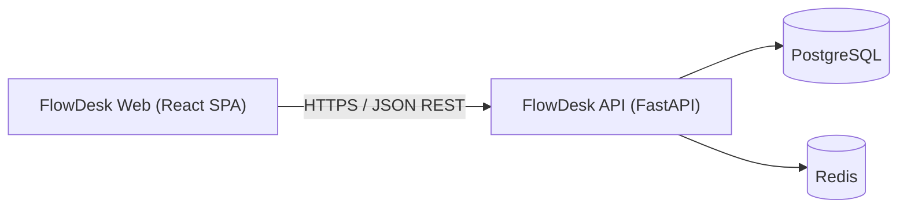

# FlowDesk

FlowDesk é uma ferramenta de gestão de issues e projetos para times de produto e engenharia —
uma alternativa de identidade própria ao Linear, construída como projeto de portfólio com
arquitetura de nível profissional.

Toda decisão de produto e arquitetura é documentada e justificada — ver [`CLAUDE.md`](./CLAUDE.md)
(o manual de engenharia do projeto) e a pasta [`docs/`](./docs), que é a fonte de verdade para
todo o desenvolvimento.

## Stack

| Camada | Tecnologia |
|---|---|
| Backend | Python 3.12, FastAPI, SQLAlchemy 2.0 (async), Alembic, Pydantic v2 |
| Banco de dados | PostgreSQL 16, Redis 7 (cache/rate limit, a partir da Sprint 2) |
| Frontend | React 19, TypeScript, Vite, Tailwind CSS, shadcn/ui |
| Estado (frontend) | TanStack Query (servidor) + Zustand (cliente, a partir da primeira necessidade real) |
| Qualidade | Ruff + Mypy (backend), ESLint + Prettier + TypeScript strict (frontend), Pytest, pre-commit, Husky |
| Infra | Docker Compose (dev), GitHub Actions (CI) |

Justificativa completa de cada escolha em [`docs/09-decision-log.md`](./docs/09-decision-log.md).

## Arquitetura

Duas aplicações desacopladas comunicando via REST/JSON — sem acoplamento de build ou runtime.
Backend em camadas estritas (`router → service → repository → model`); frontend organizado por
feature de domínio. Detalhes completos em [`docs/02-architecture.md`](./docs/02-architecture.md).



## Estrutura de pastas

```
FlowDesk/
├── CLAUDE.md              # manual de engenharia — leia antes de contribuir
├── docs/                  # visão de produto, requisitos, arquitetura, API, segurança, roadmap...
├── backend/                # API FastAPI
├── frontend/                # SPA React
├── docker/                # Dockerfiles de desenvolvimento
├── docker-compose.yml
└── .github/workflows/     # CI
```

## Como executar localmente

### Opção 1 — Docker Compose (recomendado)

Pré-requisitos: Docker e Docker Compose.

```bash
cp .env.example .env
docker compose up
```

Isso sobe PostgreSQL, Redis, backend e frontend, todos com hot-reload via volume montado:

- Frontend: http://localhost:5173
- Backend: http://localhost:8000
- Swagger (OpenAPI): http://localhost:8000/docs
- Health check: http://localhost:8000/health

### Opção 2 — Rodando cada app localmente

**Backend** (requer Python 3.12+ e [Poetry](https://python-poetry.org/)):

```bash
cd backend
cp .env.example .env   # ajuste DATABASE_URL/REDIS_URL para apontar a serviços locais
poetry install
poetry run uvicorn src.main:app --reload
```

**Frontend** (requer Node 22+):

```bash
cd frontend
cp .env.example .env.local
npm install
npm run dev
```

## Qualidade e testes

```bash
# Backend
cd backend
poetry run ruff check .        # lint
poetry run ruff format .       # format
poetry run mypy src            # type-check
poetry run pytest              # testes

# Frontend
cd frontend
npm run lint                   # ESLint
npm run format                 # Prettier
npm run type-check             # tsc --noEmit
npm run build                  # build de produção
```

Um hook de pre-commit (Husky no frontend + [pre-commit](https://pre-commit.com/) no backend,
encadeados em `frontend/.husky/pre-commit`) roda lint/format automaticamente nos arquivos
staged. Para o lado do backend funcionar localmente, instale as dependências dele uma vez:
`cd backend && poetry install`.

CI (GitHub Actions, [`.github/workflows/ci.yml`](./.github/workflows/ci.yml)) roda lint,
type-check e testes de cada app em toda PR e falha caso qualquer um desses passos falhe.

## Roadmap

Este repositório está na **Sprint 1 — Fundação**: monorepo, backend e frontend de pé sem
regra de negócio, Docker Compose, CI e ferramentas de qualidade configurados. Nenhuma
funcionalidade de produto (autenticação, workspaces, issues) existe ainda.

Roadmap completo, sprint a sprint, com critérios de aceite e Definition of Done, em
[`docs/08-roadmap.md`](./docs/08-roadmap.md).
