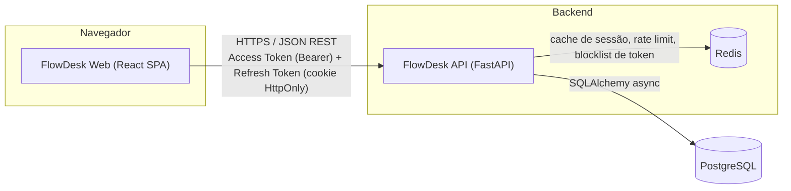
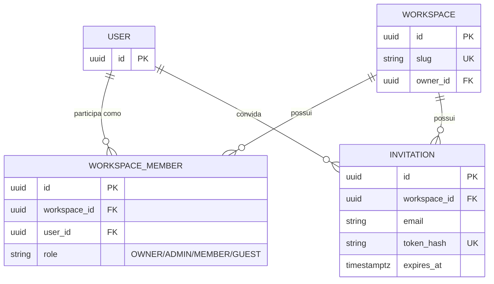
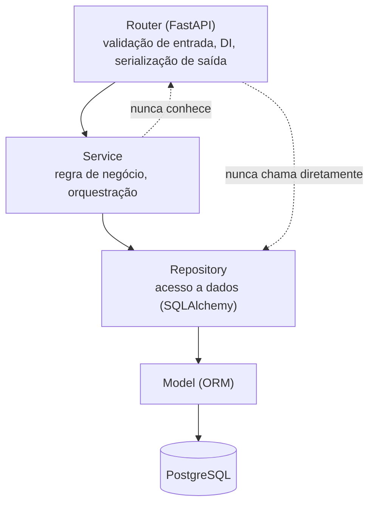
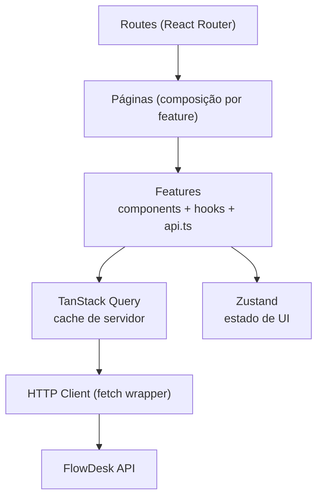

# 02 — Arquitetura

## 1. Arquitetura geral

FlowDesk é um monorepo com duas aplicações independentes que se comunicam exclusivamente via API HTTP/JSON — não há acoplamento de build nem de runtime entre elas. Essa separação (em vez de, por exemplo, um monólito Next.js full-stack) é uma decisão deliberada: ver ADR-002 e ADR-003 em `docs/09-decision-log.md`.



Características gerais:
- **API-first**: o contrato REST (`docs/04-api-design.md`) é a fonte de verdade; o frontend é um dos consumidores possíveis, não um parceiro acoplado ao backend.
- **Stateless na camada de aplicação**: a API não guarda estado de sessão em memória de processo — estado de autenticação vive no token (JWT) e no banco (refresh token), permitindo múltiplas instâncias da API atrás de um load balancer sem sticky sessions.
- **Multi-tenant por Workspace**: todo dado de domínio (times, issues, comentários) pertence a um workspace; um usuário pode pertencer a vários workspaces. Isolamento é reforçado em duas camadas independentes — autorização (checagem de posse/papel no service) e filtro obrigatório de `workspace_id` no repository — ver `docs/07-security.md` §9.

Implementado na Sprint 4 (`docs/09-decision-log.md` ADR-009). `User` e `Workspace` não têm relação direta — sempre passam por `WorkspaceMember`, a entidade de junção que carrega o papel:



Não existe uma tabela/estado de "workspace ativo" — todo endpoint de recurso de tenant recebe `workspace_id` explícito no path (`CLAUDE.md` §4), e a posse é resolvida a cada requisição contra `WorkspaceMember`, nunca cacheada em sessão de servidor nem embutida no JWT (`docs/07-security.md` §12 detalha o fluxo completo, com diagramas de convite e de resolução de acesso por requisição).

## 2. Arquitetura do backend

Arquitetura em camadas estrita, descrita normativamente em `CLAUDE.md` §3. Diagrama de dependência entre camadas (setas = "depende de"):



A seta pontilhada existe para deixar explícito o que é **proibido**: um router chamando repository diretamente (pula validação de regra de negócio) e um service importando algo de `fastapi` (acopla regra de negócio ao protocolo HTTP, impedindo reuso por um worker ou CLI futuro).

### Componentes transversais (`core/`)

- **Config**: carregamento de variáveis de ambiente via Pydantic Settings, validado na inicialização (falha rápido se uma variável obrigatória faltar).
- **DB session**: fábrica de sessão assíncrona por requisição (uma sessão por request, fechada ao final via dependency do FastAPI).
- **Security**: hashing de senha (Argon2id), emissão/validação de JWT, geração de refresh token.
- **Authorization** (`core/permissions.py` + `core/authorization.py`, Sprint 5): catálogo central `Permission`, matriz `ROLE_PERMISSIONS` por `WorkspaceRole`, `PermissionService.can(member, permission, resource_owner_id=None)`/`.require(...)`, e a dependency `require_permission(permission)` usada em toda rota de recurso de tenant (`Depends(require_permission(Permission.WORKSPACE_UPDATE))`). Ver `docs/07-security.md` §8 para o fluxo completo e a matriz.
- **Exceptions**: hierarquia de domínio e exception handler global (`CLAUDE.md` §7).
- **Logging**: configuração de `structlog`, middleware de `request_id`.

### Unit of Work

Operações que tocam mais de um repository dentro de uma mesma regra de negócio (ex.: criar issue e, na mesma transação, registrar entrada de atividade) são coordenadas por um Unit of Work explícito no service — um context manager fino sobre a sessão SQLAlchemy que garante commit/rollback atômico. Isso evita o anti-padrão de cada repository fazer seu próprio commit, que torna operações multi-tabela não-atômicas por acidente.

## 3. Arquitetura do frontend

SPA React servida como estático (build via Vite), consumindo a API via `fetch`/TanStack Query. Sem SSR — justificativa em ADR-003 (`docs/09-decision-log.md`): a aplicação inteira vive atrás de autenticação, então o principal benefício de SSR (SEO, first paint de conteúdo público) não se aplica; o custo de complexidade (hidratação, RSC, cache de servidor) não se paga.



Separação de responsabilidade de estado (decisão central do frontend, ver ADR-004):
- **Estado de servidor** (dado que existe no backend: issues, workspaces, comentários) vive exclusivamente em TanStack Query — nunca duplicado em um store de cliente.
- **Estado de cliente** (UI pura: sidebar aberta/fechada, tema, filtros ainda não aplicados) vive em Zustand.
- Isso evita a classe de bugs mais comum em apps React de dashboard: dado de servidor "cacheado à mão" em Redux/Zustand ficando dessincronizado do backend.

## 4. Separação em camadas — visão consolidada

| Camada | Backend | Frontend |
|---|---|---|
| Apresentação | Router (FastAPI) | Componentes de página/feature |
| Aplicação/negócio | Service | Hooks de feature (orquestram queries/mutations + regra de UI) |
| Acesso a dado | Repository | TanStack Query + `api.ts` (cliente HTTP) |
| Persistência/origem de dado | Model + PostgreSQL | Cache do TanStack Query (fonte de verdade do estado de servidor no cliente) |

## 5. Fluxo de uma requisição (exemplo: mudar status de uma issue)

> Diagrama atualizado na Sprint 7 para refletir a implementação real (`docs/09-decision-log.md` ADR-012): sem `Team`/`WorkflowState` (nunca implementados como feature), sem board com drag-and-drop (não implementado nesta sprint — ver `docs/08-roadmap.md`), sem transição de status inválida a validar (`status` é enum fixo, qualquer valor aceita `PATCH`).

```mermaid
sequenceDiagram
    participant U as Usuário
    participant FE as Frontend (React)
    participant MW as Middleware (auth, request-id)
    participant R as Router
    participant S as IssueService
    participant Repo as IssueRepository
    participant DB as PostgreSQL

    U->>FE: Muda o status no formulário de edição
    FE->>MW: PATCH /workspaces/{id}/issues/{issue_id} {status} + If-Match?
    MW->>MW: valida JWT, extrai usuário, gera request_id
    MW->>R: requisição autenticada
    R->>R: valida payload (schema Pydantic)
    R->>S: service.update(workspace_id, user, issue_id, payload, expected_version)
    S->>Repo: get_by_id(workspace_id, issue_id)
    Repo->>DB: SELECT ... WHERE workspace_id = ... AND id = ... AND deleted_at IS NULL
    DB-->>Repo: issue
    Repo-->>S: issue
    alt If-Match informado e diverge de issue.version
        S-->>R: 409 version_conflict
    else
        S->>Repo: record_activity(field="status", old, new)
        S->>S: issue.status = novo_status; issue.version += 1
        S->>Repo: update(issue) — flush via dirty-tracking
        Repo->>DB: UPDATE ...
        S-->>R: issue atualizada
        R-->>FE: 200 { data: { ...issue } }
        FE->>FE: invalida cache do TanStack Query (issues + detalhe)
    end
```

## 6. Dependências entre camadas (regra de importação)

- `router.py` importa `service.py` e `schemas.py` da própria feature, e módulos de `core/` (auth, DI). Nunca importa `repository.py` ou `models.py` de qualquer feature diretamente.
- `service.py` importa `repository.py` (via interface/Protocol) e módulos de `core/` que não sejam HTTP-específicos (não importa `fastapi`). Nunca importa `router.py`.
- `repository.py` importa `models.py` e a sessão de DB de `core/`. Nunca importa `service.py` ou `schemas.py`.
- Entre features, uma feature pode depender do **service** público de outra feature (ex.: `IssueService` chama `NotificationService` para notificar menção), nunca do repository interno de outra feature — isso preserva o encapsulamento do agregado.

## 7. Princípios SOLID aplicados

- **Single Responsibility**: cada arquivo de feature tem um motivo para mudar — `router.py` muda por causa de contrato HTTP, `service.py` por causa de regra de negócio, `repository.py` por causa de estratégia de consulta/persistência. Misturar essas responsabilidades no mesmo arquivo é o anti-padrão mais comum que este projeto evita ativamente.
- **Open/Closed**: `Issue.status` é um `enum` fixo (`domain_enum()`, VARCHAR sem `CHECK` nativo — `docs/03-database.md` §5) em vez de workflow por time configurável (esboço original da Sprint 0, não implementado — ver ADR-012 em `docs/09-decision-log.md`): adicionar um valor de status novo é uma migration aditiva simples, sem alterar `IssueService`. Um workflow configurável por time/workspace fica como evolução natural quando Kanban/board for pedido (`docs/08-roadmap.md`), sem exigir redesenho do schema atual.
- **Liskov Substitution**: repositories implementam uma interface (`Protocol`) mínima; um repository fake usado em teste unitário de service é substituível pelo repository real sem que o service saiba a diferença.
- **Interface Segregation**: a interface de um repository expõe apenas os métodos que aquele agregado precisa (`IssueRepository` não herda de uma interface genérica `CrudRepository<T>` com métodos que a maioria das features não usa).
- **Dependency Inversion**: services dependem de abstrações de repository (Protocol), não de implementações concretas de SQLAlchemy — a inversão é o que torna testes unitários de service possíveis sem banco.

## 8. Decisões arquiteturais (resumo — detalhamento em `docs/09-decision-log.md`)

| ID | Decisão |
|---|---|
| ADR-001 | Backend em Python/FastAPI em vez de manter TypeScript ponta a ponta |
| ADR-002 | Monorepo com apps desacoplados (API + SPA) em vez de monólito full-stack |
| ADR-003 | SPA (Vite) em vez de Next.js para o frontend |
| ADR-004 | TanStack Query + Zustand em vez de Redux Toolkit único |
| ADR-005 | JWT + Refresh Token rotativo em vez de sessão pura em servidor |
| ADR-006 | PostgreSQL em vez de banco não-relacional |
| ADR-007 | Desvios da modelagem de domínio da Sprint 2 em relação ao ER original (Team/WorkflowState no escopo, Session nova, Attachment polimórfico) |
| ADR-008 | Sprint 3 (Identidade e Autenticação): escopo e desvios de implementação |
| ADR-009 | Sprint 4 (Multi-Tenancy: Workspaces, Memberships e Convites): escopo e desvios de implementação |
| ADR-010 | Sprint 5 (RBAC): `core/authorization.py` centraliza permissão, exceção deliberada de `core/` depender de `features/workspaces/` |
| ADR-011 | Sprint 6 (Núcleo de Projetos): escopo e desvios de implementação |
| ADR-012 | Sprint 7 (Núcleo de Issues): desacoplamento de `Team`/`WorkflowState`, redesenho do schema de `Issue` |
| ADR-013 | Sprint 8 (Comentários, Labels, Anexos): menções sem notificação, Label como recurso compartilhado, ponto de extensão de storage |
| ADR-014 | Sprint 8.5 (Frontend Foundation): tokens como camada de referência, primeiro store de UI cliente-only, `teams/` deliberadamente não criado (ADR-012) |
| ADR-015 | Sprint 8.6 (Architecture Hardening): barrels/múltiplos aliases revertidos por já contradizerem decisão documentada; route builder único, code-splitting por rota |
| ADR-016 | Sprint 8.7 (Production Readiness & Observability): readiness check extensível, envelope de erro para exceções não-domínio, `user_id`/`environment` em todo log, security headers, Docker multi-stage, sem métricas/gunicorn/k8s especulativos |
| ADR-017 | Sprint 9 fase 1 (RF-AUTH-06 + rate limit por rota): `MailSender` (nunca devolve token de reset pela API, anti-enumeration), uso único + vida curta de `PasswordResetToken`, novo tier de rate limit para tráfego não-autenticado em `/api/v1/*` |
