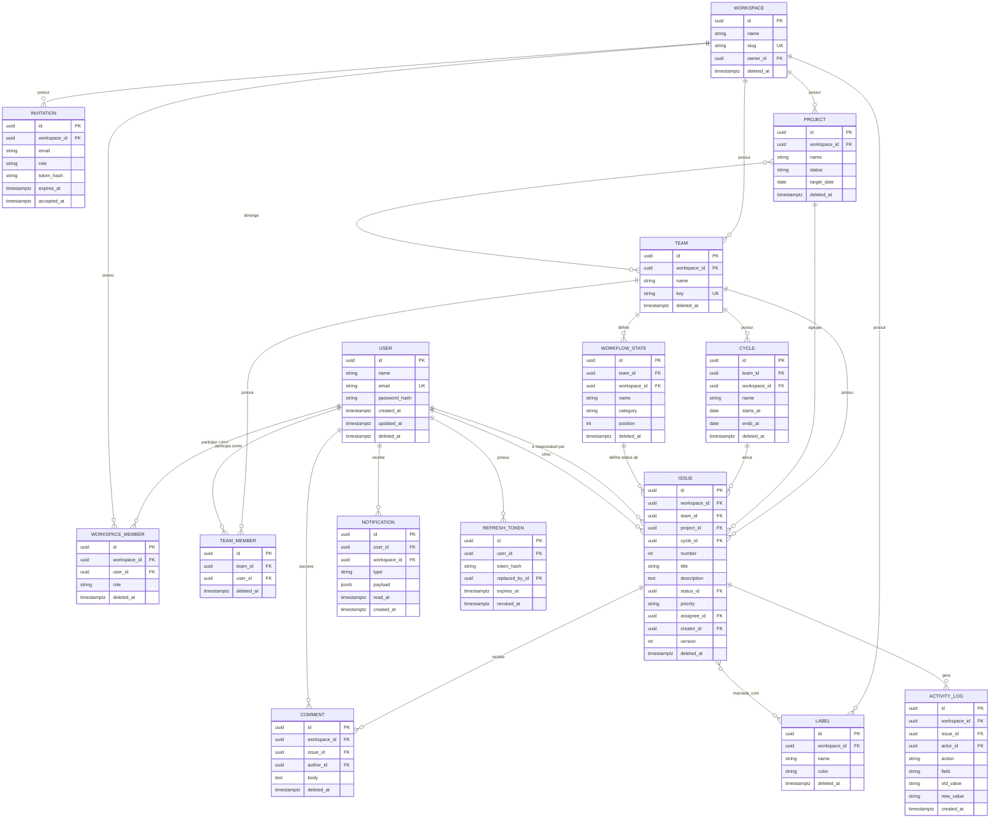

# 03 — Banco de Dados

PostgreSQL 16. Justificativa da escolha do banco em ADR-006 (`docs/09-decision-log.md`) — resumo: o domínio é fortemente relacional (workspace → time → issue → comentário, com múltiplos relacionamentos N:N como issue↔label e projeto↔time), exige transações ACID reais (mudança de status + registro de atividade na mesma unidade de trabalho) e se beneficia de constraints declarativas (unicidade de `(team_id, number)`, chaves estrangeiras) que um banco documento tornaria responsabilidade da aplicação.

## 1. Estratégia de UUID

Chaves primárias usam **UUIDv7** (não v4, não serial incremental), gerado na aplicação no momento da criação da entidade (não pelo banco), pelas seguintes razões:

- **UUIDv7 é ordenável por tempo** (os primeiros 48 bits são um timestamp): isso preserva localidade física de inserção no índice B-tree primário, evitando o problema clássico de fragmentação de índice que UUIDv4 puro causa em tabelas de alto volume de escrita (issues, comentários).
- **Não é um inteiro sequencial exposto**: um `id` incremental em uma API pública vaza informação de volume de negócio (quantas issues existem) e permite enumeration attack (tentar `/issues/1`, `/issues/2`...). UUID fecha essa classe de problema sem esforço extra.
- **Geração client-side (na aplicação, não `gen_random_uuid()` do Postgres)**: permite que o objeto de domínio tenha identidade antes do `INSERT` (útil para o padrão de Unit of Work e para idempotência de retry), e mantém a lógica de geração testável/mockável na camada de aplicação.

Alternativa rejeitada: inteiro `BIGSERIAL` (mais compacto e rápido em índice, mas vaza volume e exige um segundo identificador opaco para expor via API — complexidade duplicada sem benefício líquido neste domínio).

## 2. Soft delete

Tabelas de entidades com ciclo de vida "removível pelo usuário" têm coluna `deleted_at TIMESTAMPTZ NULL`. Ausência de exclusão física é intencional: permite desfazer exclusão acidental, preserva integridade referencial de dados históricos (uma issue excluída ainda deve aparecer no histórico de atividade de quem a criou) e evita cascatas destrutivas em produção.

Tabelas com soft delete: `workspaces`, `workspace_members`, `teams`, `team_members`, `workflow_states`, `projects`, `cycles`, `issues`, `labels`, `comments`, `users`.

Tabelas **sem** soft delete (por design, não por omissão):
- `activity_logs` — log de auditoria é append-only por natureza; "excluir" um log de auditoria contradiz seu propósito.
- `notifications` — descartável (delete físico ou expiração), não tem valor histórico que justifique soft delete.
- `issue_labels`, `project_teams` — tabelas de associação pura (N:N); a relação existe ou não existe, não tem estado "excluído logicamente".
- `refresh_tokens` — usa `revoked_at`, semanticamente diferente de soft delete (é um estado de segurança, não uma remoção lógica de registro).

Toda query de leitura em repository filtra `deleted_at IS NULL` por padrão (reforçado em `CLAUDE.md` §6).

## 3. Auditoria e versionamento

- **Timestamps padrão**: todo registro mutável tem `created_at` e `updated_at` (`TIMESTAMPTZ`, default `now()`, `updated_at` mantido via `onupdate` do SQLAlchemy).
- **Autoria**: `issues.creator_id` e `comments.author_id` capturam quem criou o registro. Mudanças subsequentes de campo (quem mudou o quê) são capturadas em `activity_logs`, não em uma coluna `updated_by` genérica — porque o requisito (RF-ISSUE-10) é histórico completo de mudanças de campo, não apenas o último editor.
- **Versionamento otimista**: `issues.version INTEGER NOT NULL DEFAULT 1`, incrementado a cada `UPDATE`. Issues são o recurso de maior contenção de escrita concorrente do sistema (múltiplos usuários arrastando a mesma issue no board ao mesmo tempo); o cliente envia a versão que possuía ao editar, e um `UPDATE ... WHERE id = :id AND version = :version` que afeta zero linhas é tratado pelo repository como conflito e traduzido pelo service em `ConflictError` (HTTP 409) — nunca um "last write wins" silencioso.

## 4. Denormalização deliberada de `workspace_id`

`teams`, `projects`, `cycles`, `issues`, `labels`, `comments`, `workflow_states`, `workspace_members` e `invitations` carregam uma coluna `workspace_id` própria, mesmo quando ela seria deriável via join (ex.: `issues.team_id → teams.workspace_id`).

Isso é uma decisão de segurança, não apenas de performance: o padrão de repository definido em `CLAUDE.md` §6 exige que **todo método de leitura/escrita de dado com escopo de tenant receba `workspace_id` explicitamente e o aplique no `WHERE`**. Se `issues` não tivesse `workspace_id` próprio, garantir isolamento exigiria um join implícito até `teams` em toda query — um único ponto onde esse join é esquecido é uma falha de isolamento entre tenants. Com a coluna denormalizada, o filtro é direto, sempre presente, e trivial de auditar em code review. O custo (manter a coluna consistente com `team.workspace_id`) é mitigado por ela ser imutável após a criação do registro (um time nunca muda de workspace).

## 5. Enums de domínio

- `workspace_members.role`: `OWNER`, `ADMIN`, `MEMBER`, `GUEST` (ver `docs/07-security.md` para a matriz de permissões).
- `workflow_states.category`: `BACKLOG`, `UNSTARTED`, `STARTED`, `COMPLETED`, `CANCELED` — categoria semântica fixa usada para agregações (ex.: "% de issues completas") independentemente do nome customizado que o time deu ao estado (`workflow_states.name`, livre, ex.: "Code Review").
- `issues.priority`: `NO_PRIORITY`, `LOW`, `MEDIUM`, `HIGH`, `URGENT`.
- `projects.status`: `PLANNED`, `IN_PROGRESS`, `COMPLETED`, `CANCELED`.
- `notifications.type`: `MENTION`, `ASSIGNMENT`, `STATUS_CHANGE` (extensível).

Implementados como `VARCHAR` com `CHECK constraint` (não `ENUM` nativo do Postgres): adicionar um valor a um `CHECK` é uma migração aditiva simples; alterar um `ENUM` nativo do Postgres historicamente exige cuidado extra (não pode remover valor, ordem importa). Trade-off aceito: perdemos a validação "gratuita" do tipo `ENUM` no nível de coluna, ganhamos migrações mais simples — validação real de qualquer forma acontece no schema Pydantic antes do dado chegar ao banco.

## 6. Entidades e relacionamentos

Tabelas de associação pura (não representadas como entidade no ER acima por serem N:N simples): `issue_labels (issue_id, label_id)`, `project_teams (project_id, team_id)`.

## 7. Cardinalidades (explícitas)

| Relacionamento | Cardinalidade | Observação |
|---|---|---|
| User ↔ Workspace | N:N via `workspace_members` | um usuário em múltiplos workspaces |
| Workspace → Team | 1:N | time pertence a exatamente um workspace |
| Team ↔ User | N:N via `team_members` | membro de time deve já ser `workspace_member` (validado em service, não em FK) |
| Team → WorkflowState | 1:N | workflow é por time, não global |
| Team → Issue | 1:N | issue pertence a exatamente um time |
| Project ↔ Team | N:N via `project_teams` | projeto pode abranger múltiplos times |
| Project → Issue | 1:N, opcional | `issue.project_id` nullable |
| Cycle → Issue | 1:N, opcional | `issue.cycle_id` nullable |
| Issue → Comment | 1:N | |
| Issue ↔ Label | N:N via `issue_labels` | label pertence ao workspace, reusável entre times |
| Issue → ActivityLog | 1:N | append-only |
| User → RefreshToken | 1:N | um token ativo por dispositivo/sessão |

## 8. Constraints principais

- `users.email`: `UNIQUE`, validado também em `ValidationError` de aplicação antes do banco (mensagem amigável em vez de erro de constraint bruto).
- `workspaces.slug`: `UNIQUE`, formato validado por regex no schema (`^[a-z0-9-]+$`).
- `workspace_members`: `UNIQUE (workspace_id, user_id) WHERE deleted_at IS NULL` (constraint parcial — permite readicionar um membro removido sem violar unicidade contra o registro soft-deleted antigo).
- `team_members`: `UNIQUE (team_id, user_id) WHERE deleted_at IS NULL`.
- `teams.key`: `UNIQUE (workspace_id, key)` — o código curto (`ENG`, `PROD`) é único dentro do workspace, não globalmente.
- `issues`: `UNIQUE (team_id, number)` — número legível sequencial por time (`ENG-123`), gerado por sequência dedicada por time (implementada via tabela de contador com `SELECT ... FOR UPDATE` no service, para evitar gap/corrida sem depender de `SERIAL` global).
- `labels.name`: `UNIQUE (workspace_id, name) WHERE deleted_at IS NULL`.
- Todas as FKs usam `ON DELETE RESTRICT` por padrão (exclusão física nunca deveria acontecer via cascade automático dado o soft delete; a única exceção são as tabelas de associação pura, `ON DELETE CASCADE`, pois não têm ciclo de vida próprio).

## 9. Índices

| Tabela | Índice | Motivo |
|---|---|---|
| `workspace_members` | `(user_id)` | "listar meus workspaces" |
| `workspace_members` | `(workspace_id, deleted_at)` | "listar membros ativos do workspace" |
| `issues` | `(team_id, status_id, deleted_at)` | board por status (RF-ISSUE-07), a query mais frequente do sistema |
| `issues` | `(workspace_id, deleted_at, updated_at DESC)` | listagem geral/paginação do workspace |
| `issues` | `(assignee_id, deleted_at)` | "minhas issues" |
| `issues` | GIN em `to_tsvector('simple', title || ' ' || description)` | busca textual (RF-ISSUE-09) |
| `comments` | `(issue_id, deleted_at, created_at)` | thread ordenada por issue |
| `activity_logs` | `(issue_id, created_at)` | timeline de atividade por issue |
| `notifications` | `(user_id, read_at, created_at DESC)` | lista de notificações não lidas primeiro |
| `refresh_tokens` | `(user_id, revoked_at)` | invalidar todas as sessões de um usuário |

Todo índice composto tem `deleted_at` como parte da chave (não como filtro pós-scan) porque o soft delete filter está presente em praticamente 100% das queries de leitura — colocá-lo no índice evita scan de linhas mortas.

## 10. Migrations

Alembic, uma migration por mudança de schema logicamente coesa (nunca uma migration "catch-all" no fim da sprint). Toda migration:
- É reversível (`downgrade()` implementado, não `pass`).
- Não faz `ALTER COLUMN ... NOT NULL` direto em tabela com dados sem uma migration prévia de backfill — mudanças em tabela populada seguem o padrão *expand → backfill → contract* (adiciona nullable → popula → torna `NOT NULL` em migration separada).
- É testada localmente contra uma cópia do banco de desenvolvimento antes de ir para CI.
