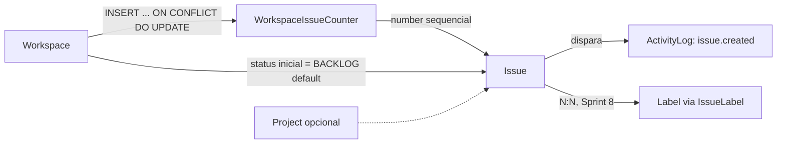

# 03 — Banco de Dados

PostgreSQL 16. Justificativa da escolha do banco em ADR-006 (`docs/09-decision-log.md`) — resumo: o domínio é fortemente relacional (workspace → time → issue → comentário, com múltiplos relacionamentos N:N como issue↔label e projeto↔time), exige transações ACID reais (mudança de status + registro de atividade na mesma unidade de trabalho) e se beneficia de constraints declarativas (unicidade de `(team_id, number)`, chaves estrangeiras) que um banco documento tornaria responsabilidade da aplicação.

## 1. Estratégia de UUID

Chaves primárias usam **UUIDv7** (não v4, não serial incremental), gerado na aplicação no momento da criação da entidade (não pelo banco), pelas seguintes razões:

- **UUIDv7 é ordenável por tempo** (os primeiros 48 bits são um timestamp): isso preserva localidade física de inserção no índice B-tree primário, evitando o problema clássico de fragmentação de índice que UUIDv4 puro causa em tabelas de alto volume de escrita (issues, comentários).
- **Não é um inteiro sequencial exposto**: um `id` incremental em uma API pública vaza informação de volume de negócio (quantas issues existem) e permite enumeration attack (tentar `/issues/1`, `/issues/2`...). UUID fecha essa classe de problema sem esforço extra.
- **Geração client-side (na aplicação, não `gen_random_uuid()` do Postgres)**: permite que o objeto de domínio tenha identidade antes do `INSERT` (útil para o padrão de Unit of Work e para idempotência de retry), e mantém a lógica de geração testável/mockável na camada de aplicação.

Alternativa rejeitada: inteiro `BIGSERIAL` (mais compacto e rápido em índice, mas vaza volume e exige um segundo identificador opaco para expor via API — complexidade duplicada sem benefício líquido neste domínio).

## 2. Soft delete

Tabelas de entidades com ciclo de vida "removível pelo usuário" têm coluna `deleted_at TIMESTAMPTZ NULL`. Ausência de exclusão física é intencional: permite desfazer exclusão acidental, preserva integridade referencial de dados históricos (uma issue excluída ainda deve aparecer no histórico de atividade de quem a criou) e evita cascatas destrutivas em produção.

Tabelas com soft delete: `workspaces`, `workspace_members`, `invitations`, `teams`, `team_members`, `workflow_states`, `projects`, `issues`, `labels`, `comments`, `attachments`, `users`.

`invitations` ganhou soft delete na Sprint 2 (não estava no desenho original da Sprint 0): permite a um `OWNER`/`ADMIN` cancelar um convite pendente sem apagar o histórico de quem convidou quem — mesma lógica já aplicada ao resto do domínio (ver ADR em `docs/09-decision-log.md`).

`attachments` também tem soft delete (entidade nova da Sprint 2): um anexo pode ser removido individualmente pelo usuário sem exigir excluir a issue/comentário inteiro.

Tabelas **sem** soft delete (por design, não por omissão):
- `activity_logs` — log de auditoria é append-only por natureza; "excluir" um log de auditoria contradiz seu propósito.
- `notifications` — descartável (delete físico ou expiração), não tem valor histórico que justifique soft delete.
- `issue_labels` — tabela de associação pura (N:N); a relação existe ou não existe, não tem estado "excluído logicamente". `ON DELETE CASCADE` cuida da limpeza se `issues`/`labels` forem removidos fisicamente.
- `sessions`, `refresh_tokens` — usam `revoked_at`, semanticamente diferente de soft delete (é um estado de segurança, não uma remoção lógica de registro). Ver `docs/09-decision-log.md` para a entidade `Session`, introduzida na Sprint 2 entre `User` e `RefreshToken`.
- `password_reset_tokens` (Sprint 9, RF-AUTH-06) — mesmo racional de `refresh_tokens`, mas uso único (`used_at`, não uma cadeia de rotação) e vida curta (`Settings.password_reset_token_expire_minutes`, default 30 min); descartável, sem valor histórico após expirar/usar (ADR-017).
- `team_issue_counters` — tabela de contador interno, sem ciclo de vida de "exclusão" próprio (existe e é atualizada enquanto o time existir).

Toda query de leitura em repository filtra `deleted_at IS NULL` por padrão (reforçado em `CLAUDE.md` §6).

## 3. Auditoria e versionamento

- **Timestamps padrão**: todo registro mutável tem `created_at` e `updated_at` (`TIMESTAMPTZ`, default `now()`, `updated_at` mantido via `onupdate` do SQLAlchemy).
- **Autoria**: `issues.creator_id` e `comments.author_id` capturam quem criou o registro. Mudanças subsequentes de campo (quem mudou o quê) são capturadas em `activity_logs`, não em uma coluna `updated_by` genérica — porque o requisito (RF-ISSUE-10) é histórico completo de mudanças de campo, não apenas o último editor.
- **Versionamento otimista**: `issues.version INTEGER NOT NULL DEFAULT 1`, incrementado a cada `UPDATE`. Issues são o recurso de maior contenção de escrita concorrente do sistema (múltiplos usuários arrastando a mesma issue no board ao mesmo tempo); o cliente envia a versão que possuía ao editar, e um `UPDATE ... WHERE id = :id AND version = :version` que afeta zero linhas é tratado pelo repository como conflito e traduzido pelo service em `ConflictError` (HTTP 409) — nunca um "last write wins" silencioso.

## 4. Denormalização deliberada de `workspace_id`

`teams`, `projects`, `issues`, `labels`, `comments`, `workflow_states`, `workspace_members`, `invitations`, `attachments` e `activity_logs` carregam uma coluna `workspace_id` própria, mesmo quando ela seria deriável via join (ex.: `issues.team_id → teams.workspace_id`).

Isso é uma decisão de segurança, não apenas de performance: o padrão de repository definido em `CLAUDE.md` §6 exige que **todo método de leitura/escrita de dado com escopo de tenant receba `workspace_id` explicitamente e o aplique no `WHERE`**. Se `issues` não tivesse `workspace_id` próprio, garantir isolamento exigiria um join implícito até `teams` em toda query — um único ponto onde esse join é esquecido é uma falha de isolamento entre tenants. Com a coluna denormalizada, o filtro é direto, sempre presente, e trivial de auditar em code review. O custo (manter a coluna consistente com `team.workspace_id`) é mitigado por ela ser imutável após a criação do registro (um time nunca muda de workspace).

## 5. Enums de domínio

- `workspace_members.role`: `OWNER`, `ADMIN`, `MEMBER`, `GUEST` (ver `docs/07-security.md` para a matriz de permissões).
- `workflow_states.category`: `BACKLOG`, `UNSTARTED`, `STARTED`, `COMPLETED`, `CANCELED` — categoria semântica fixa usada para agregações (ex.: "% de issues completas") independentemente do nome customizado que o time deu ao estado (`workflow_states.name`, livre, ex.: "Code Review").
- `issues.priority`: `NO_PRIORITY`, `LOW`, `MEDIUM`, `HIGH`, `URGENT`.
- `projects.status`: `ACTIVE`, `ARCHIVED` — redefinido na Sprint 6 a partir do placeholder especulativo de 4 valores modelado na Sprint 2 (`PLANNED`/`IN_PROGRESS`/`COMPLETED`/`CANCELED`); a tabela nunca teve linha em produção e o contrato de negócio real (arquivar/restaurar) não é um workflow de progresso — ver ADR-011 em `docs/09-decision-log.md`.
- `notifications.type`: `MENTION`, `ASSIGNMENT`, `STATUS_CHANGE` (extensível).

Implementados como `VARCHAR` com `CHECK constraint` (não `ENUM` nativo do Postgres): adicionar um valor a um `CHECK` é uma migração aditiva simples; alterar um `ENUM` nativo do Postgres historicamente exige cuidado extra (não pode remover valor, ordem importa). Trade-off aceito: perdemos a validação "gratuita" do tipo `ENUM` no nível de coluna, ganhamos migrações mais simples — validação real de qualquer forma acontece no schema Pydantic antes do dado chegar ao banco.

Implementação (Sprint 2): `backend/src/db/base.py::domain_enum()` — um `sqlalchemy.Enum(PyEnum, native_enum=False, values_callable=...)` reutilizado pelas 5 colunas acima, para não repetir o boilerplate em cada `models.py` de feature.

## 6. Entidades e relacionamentos

Modelagem completa da Sprint 2 (18 tabelas), com uma tabela adicional (`WorkspaceActivityLog`, 19ª) na Sprint 4 — ver §6.1 —, uma 20ª (`ProjectActivityLog`) na Sprint 6 — ver §6.2 —, uma 21ª (`WorkspaceIssueCounter`) na Sprint 7 — ver §6.3 — e mais duas na Sprint 8 (`CommentMention`, `LabelActivityLog`, 22ª e 23ª) — ver §6.4. Duas mudanças da Sprint 2 em relação ao desenho original da Sprint 0, ambas justificadas em ADR próprio (`docs/09-decision-log.md`):

- **`Session`** é nova, entre `User` e `RefreshToken` — representa um login/dispositivo; `RefreshToken` agora pertence a uma `Session` (não a um `User` direto), e revogar a sessão revoga junto seu token ativo.
- **`Team`, `TeamMember`, `WorkflowState`, `TeamIssueCounter`** (a última é só a implementação da "tabela de contador" já prevista em §8) e **`Project`** entraram no escopo desta sprint — `Cycle` e o join `Project ↔ Team` continuam fora, ainda pós-MVP (`docs/00-product-vision.md` §5).
- **`Attachment`** é nova — associação polimórfica simples com `Issue` **ou** `Comment` via duas FKs nullable + `CHECK`.

### 6.1 Adições da Sprint 4 (Multi-Tenancy)

- **`Workspace.description`** (`string`, nullable) — coluna aditiva (`ALTER TABLE ... ADD COLUMN`, migration `56d54b9ad393`), não fazia parte do desenho original da Sprint 2.
- **`WorkspaceActivityLog`** (`workspace_activity_logs`, migration `c2792667d7f6`) — auditoria de eventos de nível de workspace (criação, atualização, exclusão, convite enviado/aceito, saída de membro). Tabela nova, deliberadamente **não** reaproveitando `ActivityLog`/`activity_logs` (que é o histórico de mudança de campo de uma `Issue`, com `issue_id` obrigatório) — ver ADR-009 em `docs/09-decision-log.md` para o racional completo. Guarda `metadata` como `JSONB` (payload livre por tipo de evento) em vez das colunas fixas `field`/`old_value`/`new_value` de `ActivityLog`, já que os eventos de workspace não têm uma forma de diff de campo único em comum.

### 6.2 Adições da Sprint 6 (Projects)

- **`Project`** ganhou `slug`, `icon`, `color` e `created_by` (migration `fc0a10c66145`) — `slug`/`created_by` adicionados diretamente `NOT NULL` (sem o padrão *expand → backfill → contract* de §10) porque a tabela nunca teve linha em produção: a feature existia só como schema desde a Sprint 2, sem router. `slug` é auto-derivado de `name` (mesma transliteração `unicodedata`, `core/slug.py`) com retry por sufixo aleatório em colisão. `status` foi redefinido de `PLANNED/IN_PROGRESS/COMPLETED/CANCELED` (placeholder especulativo da Sprint 2) para `ACTIVE/ARCHIVED` — mudança só em `models.py`, sem DDL, já que a coluna nunca teve `CHECK constraint` (§5). `target_date`/`lead_id` (Sprint 2) seguem sem uso por nenhuma regra de negócio desta sprint, reservados para Cycles/Dashboard. Ver ADR-011 em `docs/09-decision-log.md`.
- **`ProjectActivityLog`** (`project_activity_logs`, migration `0aa72aead06a`) — auditoria de eventos de projeto (`project.created`, `project.updated` com diff por campo, `project.archived`, `project.restored`, `project.deleted`). Mesmo formato de `WorkspaceActivityLog` (`metadata JSONB`, append-only, sem `updated_at`/soft delete). Tabela própria em vez de reaproveitar `activity_logs`/`workspace_activity_logs`, pelo mesmo racional já aplicado à criação de `WorkspaceActivityLog` (ADR-009, Decisão 1) — ver ADR-011.

### 6.3 Adições/alterações da Sprint 7 (Núcleo de Issues)

O pedido explícito do usuário para esta sprint desacoplou `Issue` de `Team`/`WorkflowState` (nunca implementados como feature — só schema dormant desde a Sprint 2) — ver ADR-012 em `docs/09-decision-log.md` para o racional completo de cada decisão abaixo. Migration `c573b41b553c`, destrutiva sobre a tabela `issues` criada na Sprint 2 (aceitável pois a tabela nunca teve linha em produção — mesma justificativa da Sprint 6/ADR-011 para `Project.status`).

- **`issues.team_id` e `issues.status_id` removidos.** `Issue` passa a ser escopada só a `workspace_id` (obrigatório) + `project_id` (opcional, inalterado). `status_id` (FK para `workflow_states`) é substituído por `status: IssueStatus` — enum fixo (`BACKLOG`/`TODO`/`IN_PROGRESS`/`IN_REVIEW`/`DONE`/`CANCELED`), mesmo padrão `domain_enum()` de `priority` (VARCHAR sem `CHECK` nativo — adicionar um valor novo é migration aditiva simples).
- **`issues.number` agora único por `(workspace_id, number)`**, não mais `(team_id, number)` — mesma regra de nunca-reciclagem mesmo após soft delete (§8). `identifier` (`FD-{number}`) é uma `@property` do model, não uma coluna — `CLAUDE.md` §3 permite comportamento trivial derivado de dado em um model.
- **`issues.estimate`** (`INTEGER`, nullable — pontos de esforço) e **`issues.due_date`** (`DATE`, nullable) são colunas novas pedidas pelo enunciado da sprint, ausentes do desenho original da Sprint 2.
- **`WorkspaceIssueCounter`** (`workspace_issue_counters`, nova tabela) — substitui `TeamIssueCounter` como gerador do número sequencial, agora por workspace. Ao contrário de `TeamIssueCounter` (linha pré-criada por `TeamRepository.create()`), a linha é criada sob demanda via `INSERT ... ON CONFLICT (workspace_id) DO UPDATE ... RETURNING` na primeira issue do workspace — não há gancho de "workspace criado" que esta sprint tenha adicionado a `WorkspaceService`.
- **`Team`/`TeamMember`/`WorkflowState`/`TeamIssueCounter` permanecem no schema**, sem nenhum consumidor até uma sprint futura de Kanban/board por time os retomar (ver Impacto futuro do ADR-012) — não removidos, sem custo de manutenção real em ficar ociosos.

### 6.4 Adições da Sprint 8 (Comentários, Labels, Anexos)

O pedido explícito do usuário ao final da Sprint 7 apontou esta sprint para Comentários, Labels e Anexos (`Comment`/`Label`/`Attachment`, todos já modelados desde a Sprint 2) — ver ADR-013 em `docs/09-decision-log.md` para o racional completo. Diferente da Sprint 7, nenhuma tabela existente foi alterada de forma destrutiva: todas as mudanças são aditivas.

- **`CommentMention`** (`comment_mentions`, migration `3113f34f2a20`) — associação pura N:N entre `Comment` e o `User` mencionado (`@local-part-do-email` no corpo), mesmo padrão de classe explícita (não `Table` solta) de `IssueLabel`, para deixar espaço a metadado futuro (ex.: `notified_at`) sem exigir converter uma `Table` em entidade depois.
- **`labels.description`** (`string`, nullable, migration `a7c1d9f0b2e4`) — coluna aditiva, ausente do desenho original da Sprint 2.
- **`LabelActivityLog`** (`label_activity_logs`, migration `f5044a958f94`) — auditoria do ciclo de vida do próprio `Label` (criação/atualização/exclusão), mesmo formato de `WorkspaceActivityLog`/`ProjectActivityLog` (`metadata JSONB`, append-only). Tabela própria em vez de reaproveitar `ActivityLog` (`issue_id` obrigatório) pelo mesmo racional já aplicado a `WorkspaceActivityLog` (ADR-009) — eventos de ciclo de vida de um Label não pertencem a nenhuma Issue; só quando um Label é *aplicado/removido de uma Issue* é que o evento (`label.added`/`label.removed`) vai para a `ActivityLog` da Issue.
- **`attachments.storage_provider`** (`string`, `NOT NULL`, migration `f42ae23f3ec0`) — adicionada `NOT NULL` direto com `server_default` temporário (sem *expand → backfill → contract*, §10), mesma justificativa de `projects.slug`/`created_by` na Sprint 6 (ADR-011): `attachments` nunca teve linha em produção, a feature existia só como schema+repository desde a Sprint 2, sem service/router até esta sprint. Identifica qual `StorageProvider` (`core/storage.py`) persistiu o arquivo — `"local"` nesta sprint (disco local sob `var/uploads/`), abrindo caminho para um provider `"s3"` coexistir com dados antigos no futuro sem migração retroativa.
- **`Comment`/`Label`/`Attachment` em si não são novas tabelas** — existiam desde a `create_comments`/`create_labels`/`create_attachments` da Sprint 2 (§10), só sem service/router/schemas até esta sprint (mesmo padrão "schema dormant" já visto em `Team`/`WorkflowState`, ADR-012).

### 6.5 Adições da Sprint 9 (Notificações, Recuperação de Senha, Rate Limiting)

- **`PasswordResetToken`** (`password_reset_tokens`, migration `f4c36aa63332`) — nova tabela, RF-AUTH-06. Uso único (`used_at`, não uma cadeia de rotação como `RefreshToken.replaced_by_id`) e vida curta (`Settings.password_reset_token_expire_minutes`, default 30 min — bem menor que `refresh_tokens`/`invitations`, ver ADR-017). `user_id` FK `RESTRICT` para `users`, `token_hash` único (SHA-256 do token opaco, mesmo padrão de `refresh_tokens`/`invitations`).

```mermaid
erDiagram
    USER ||--o{ SESSION : autentica
    SESSION ||--o{ REFRESH_TOKEN : rotaciona
    USER ||--o{ WORKSPACE_MEMBER : "participa como"
    WORKSPACE ||--o{ WORKSPACE_MEMBER : possui
    WORKSPACE ||--o{ INVITATION : possui
    WORKSPACE ||--o{ TEAM : possui
    WORKSPACE ||--o{ PROJECT : possui
    WORKSPACE ||--o{ LABEL : possui

    TEAM ||--o{ TEAM_MEMBER : possui
    USER ||--o{ TEAM_MEMBER : "participa como"
    TEAM ||--o{ WORKFLOW_STATE : define
    TEAM ||--|| TEAM_ISSUE_COUNTER : conta

    WORKSPACE ||--|| WORKSPACE_ISSUE_COUNTER : conta
    WORKSPACE ||--o{ ISSUE : possui
    PROJECT ||--o{ ISSUE : agrupa

    USER ||--o{ ISSUE : "é responsável por"
    USER ||--o{ ISSUE : "criou"

    ISSUE ||--o{ COMMENT : recebe
    USER ||--o{ COMMENT : escreve
    COMMENT ||--o{ COMMENT_MENTION : menciona
    USER ||--o{ COMMENT_MENTION : "é mencionado em"

    ISSUE ||--o{ ISSUE_LABEL : marcada_com
    LABEL ||--o{ ISSUE_LABEL : aplicada_em
    ISSUE ||--o{ ACTIVITY_LOG : gera

    USER ||--o{ NOTIFICATION : recebe

    ISSUE ||--o{ ATTACHMENT : recebe
    COMMENT ||--o{ ATTACHMENT : recebe
    USER ||--o{ ATTACHMENT : envia

    WORKSPACE ||--o{ WORKSPACE_ACTIVITY_LOG : gera
    USER ||--o{ WORKSPACE_ACTIVITY_LOG : "é autor de"

    PROJECT ||--o{ PROJECT_ACTIVITY_LOG : gera
    USER ||--o{ PROJECT_ACTIVITY_LOG : "é autor de"

    LABEL ||--o{ LABEL_ACTIVITY_LOG : gera
    USER ||--o{ LABEL_ACTIVITY_LOG : "é autor de"

    USER {
        uuid id PK
        string name
        string email UK "único case-insensitive"
        string password_hash
        string avatar_url
        timestamptz created_at
        timestamptz updated_at
        timestamptz deleted_at
    }

    SESSION {
        uuid id PK
        uuid user_id FK
        string user_agent
        string ip_address
        timestamptz last_seen_at
        timestamptz revoked_at
    }

    REFRESH_TOKEN {
        uuid id PK
        uuid session_id FK
        string token_hash UK
        uuid replaced_by_id FK
        timestamptz expires_at
        timestamptz revoked_at
    }

    WORKSPACE {
        uuid id PK
        string name
        string slug UK
        string description
        uuid owner_id FK
        timestamptz deleted_at
    }

    WORKSPACE_MEMBER {
        uuid id PK
        uuid workspace_id FK
        uuid user_id FK
        string role
        timestamptz deleted_at
    }

    INVITATION {
        uuid id PK
        uuid workspace_id FK
        string email
        string role
        string token_hash UK
        uuid invited_by_id FK
        timestamptz expires_at
        timestamptz accepted_at
        timestamptz deleted_at
    }

    TEAM {
        uuid id PK
        uuid workspace_id FK
        string name
        string key UK
        timestamptz deleted_at
    }

    TEAM_MEMBER {
        uuid id PK
        uuid team_id FK
        uuid user_id FK
        timestamptz deleted_at
    }

    WORKFLOW_STATE {
        uuid id PK
        uuid team_id FK
        uuid workspace_id FK
        string name
        string category
        int position
        bool is_default
        timestamptz deleted_at
    }

    TEAM_ISSUE_COUNTER {
        uuid team_id PK_FK
        int next_number
    }

    WORKSPACE_ISSUE_COUNTER {
        uuid workspace_id PK_FK
        int next_number
    }

    PROJECT {
        uuid id PK
        uuid workspace_id FK
        string name
        string slug UK
        text description
        string icon
        string color
        string status
        date target_date
        uuid lead_id FK
        uuid created_by FK
        timestamptz deleted_at
    }

    ISSUE {
        uuid id PK
        uuid workspace_id FK
        uuid project_id FK "nullable"
        int number "único por workspace; identifier = FD-{number}"
        string title
        text description
        string status
        string priority
        uuid assignee_id FK
        uuid creator_id FK
        int estimate
        date due_date
        int version
        timestamptz deleted_at
    }

    LABEL {
        uuid id PK
        uuid workspace_id FK
        string name
        string color
        string description "nullable, Sprint 8"
        timestamptz deleted_at
    }

    LABEL_ACTIVITY_LOG {
        uuid id PK
        uuid workspace_id FK
        uuid label_id FK
        uuid actor_id FK
        string action
        jsonb metadata
        timestamptz created_at
    }

    ISSUE_LABEL {
        uuid issue_id PK_FK
        uuid label_id PK_FK
        timestamptz created_at
    }

    COMMENT {
        uuid id PK
        uuid workspace_id FK
        uuid issue_id FK
        uuid author_id FK
        text body
        timestamptz deleted_at
    }

    COMMENT_MENTION {
        uuid comment_id PK_FK
        uuid mentioned_user_id PK_FK
        timestamptz created_at
    }

    ACTIVITY_LOG {
        uuid id PK
        uuid workspace_id FK
        uuid issue_id FK
        uuid actor_id FK
        string action
        string field
        string old_value
        string new_value
        timestamptz created_at
    }

    WORKSPACE_ACTIVITY_LOG {
        uuid id PK
        uuid workspace_id FK
        uuid actor_id FK
        string action
        jsonb metadata
        timestamptz created_at
    }

    PROJECT_ACTIVITY_LOG {
        uuid id PK
        uuid workspace_id FK
        uuid project_id FK
        uuid actor_id FK
        string action
        jsonb metadata
        timestamptz created_at
    }

    NOTIFICATION {
        uuid id PK
        uuid user_id FK
        uuid workspace_id FK
        string type
        jsonb payload
        timestamptz read_at
        timestamptz created_at
    }

    ATTACHMENT {
        uuid id PK
        uuid workspace_id FK
        uuid issue_id FK "nullable"
        uuid comment_id FK "nullable"
        uuid uploader_id FK
        string file_name
        string content_type
        bigint file_size
        string storage_key
        string storage_provider "Sprint 8, default local"
        timestamptz deleted_at
    }
```

### Fluxo entre entidades — criação de uma issue



Desde a Sprint 7 (ADR-012 em `docs/09-decision-log.md`), `Issue` não depende mais de `Team`/`WorkflowState` — `status` é um enum fixo com default `BACKLOG`, e o número sequencial vem de `WorkspaceIssueCounter`, criado sob demanda na primeira issue do workspace (sem pré-condição de setup, ao contrário do antigo fluxo via `TeamIssueCounter`/`WorkflowState.is_default`).

## 7. Cardinalidades (explícitas)

| Relacionamento | Cardinalidade | Observação |
|---|---|---|
| User ↔ Workspace | N:N via `workspace_members` | um usuário em múltiplos workspaces |
| User → Session | 1:N | uma sessão por dispositivo/login |
| Session → RefreshToken | 1:N | histórico de rotação; só um token ativo por vez |
| Workspace → Team | 1:N | time pertence a exatamente um workspace (sem uso por nenhuma regra de negócio desde a Sprint 7 — ver ADR-012) |
| Team ↔ User | N:N via `team_members` | membro de time deve já ser `workspace_member` (validado em service, não em FK) |
| Team → WorkflowState | 1:N | workflow é por time, não global (ocioso desde a Sprint 7) |
| Team → TeamIssueCounter | 1:1 | contador dedicado, não compartilha lock de linha com `teams` (ocioso desde a Sprint 7) |
| Workspace → Issue | 1:N | issue pertence a exatamente um workspace (Sprint 7, substitui Team → Issue) |
| Workspace → WorkspaceIssueCounter | 1:1 | contador de `number` por workspace (Sprint 7) |
| Project → Issue | 1:N, opcional | `issue.project_id` nullable |
| Issue → Comment | 1:N | |
| Comment ↔ User | N:N via `comment_mentions` (`CommentMention`, Sprint 8) | menção detectada por `@local-part-do-email` no `body` |
| Issue ↔ Label | N:N via `issue_labels` (`IssueLabel`) | label pertence ao workspace |
| Label → LabelActivityLog | 1:N | append-only, ciclo de vida do Label (Sprint 8) |
| Issue → ActivityLog | 1:N | append-only |
| Issue → Attachment | 1:N, opcional | polimórfico com Comment (nunca os dois) |
| Comment → Attachment | 1:N, opcional | idem — sem consumidor nesta sprint (só Issue, ADR-013) |
| User → RefreshToken | indireto via Session | ver acima |

## 8. Constraints principais

- `users.email`: único via índice funcional `lower(email)` — case-insensitive sem depender do schema HTTP (que ainda não existe) para normalizar entrada.
- `workspaces.slug`: `UNIQUE WHERE deleted_at IS NULL`, formato validado no schema HTTP (`^[a-z0-9]+(?:-[a-z0-9]+)*$`, 3–50 caracteres — Sprint 4, `backend/src/features/workspaces/schemas.py`) — mais estrito que `[a-z0-9-]+`, rejeita hífen duplicado/nas pontas.
- `workspace_members`: `UNIQUE (workspace_id, user_id) WHERE deleted_at IS NULL` (constraint parcial — permite readicionar um membro removido sem violar unicidade contra o registro soft-deleted antigo).
- `invitations`: `UNIQUE (workspace_id, email) WHERE accepted_at IS NULL AND deleted_at IS NULL` — no máximo um convite pendente por e-mail por workspace.
- `team_members`: `UNIQUE (team_id, user_id) WHERE deleted_at IS NULL`.
- `teams.key`: `UNIQUE (workspace_id, key) WHERE deleted_at IS NULL` — o código curto (`ENG`, `PROD`) é único dentro do workspace, não globalmente.
- `workflow_states`: `UNIQUE (team_id, name)` e `UNIQUE (team_id, position)`, ambos parciais; mais `UNIQUE (team_id) WHERE is_default AND deleted_at IS NULL` — no máximo um estado default por time.
- `projects.slug`: `UNIQUE (workspace_id, slug) WHERE deleted_at IS NULL` (índice `uq_projects_workspace_id_slug_active`, Sprint 6, migration `fc0a10c66145`) — mesmo padrão parcial de `workspaces.slug`, slug fica livre de novo após soft delete.
- `projects.name`: `UNIQUE (workspace_id, lower(name)) WHERE deleted_at IS NULL` (índice `uq_projects_workspace_id_name_active`, Sprint 6) — unicidade case-insensitive por workspace, checada também no service antes do insert/update (defesa em profundidade, mesmo racional de `docs/03-database.md` §4).
- `issues`: `UNIQUE (workspace_id, number)` **sem** filtro parcial (Sprint 7 — antes `(team_id, number)`, ver ADR-012) — ao contrário de slug/key/name, o número não pode ser reciclado após soft delete (evita `FD-123` apontar para duas issues diferentes ao longo do tempo). Gerado via `WorkspaceIssueCounter` com `INSERT ... ON CONFLICT DO UPDATE ... RETURNING` no repository, atômico sem exigir uma linha pré-criada nem depender de `SERIAL` global.
- `labels.name`: `UNIQUE (workspace_id, name) WHERE deleted_at IS NULL`.
- `attachments`: `CHECK (num_nonnulls(issue_id, comment_id) = 1)` — exatamente um dos dois nunca os dois, nunca nenhum.
- `comment_mentions`: `PRIMARY KEY (comment_id, mentioned_user_id)` (Sprint 8) — um usuário mencionado no máximo uma vez por comentário; `ON DELETE CASCADE` em ambas as FKs, por não ter ciclo de vida próprio (mesmo racional de `issue_labels`).
- Todas as FKs usam `ON DELETE RESTRICT` por padrão (exclusão física nunca deveria acontecer via cascade automático dado o soft delete; a única exceção é `issue_labels`, `ON DELETE CASCADE`, por não ter ciclo de vida próprio — os relacionamentos ORM correspondentes usam `passive_deletes=True` para não competir com a constraint do banco).

## 9. Índices

| Tabela | Índice | Motivo |
|---|---|---|
| `users` | único funcional em `lower(email)` | login case-insensitive sem duplicar conta |
| `sessions` | `(user_id, revoked_at)` | "revogar todas as sessões do usuário" |
| `refresh_tokens` | `(session_id)` | localizar o token ativo de uma sessão |
| `password_reset_tokens` | `(user_id)` | invalidar tokens ativos anteriores ao emitir um novo (Sprint 9) |
| `workspace_members` | `(user_id)` | "listar meus workspaces" |
| `workspace_members` | `(workspace_id, deleted_at)` | "listar membros ativos do workspace" |
| `projects` | `(workspace_id, deleted_at)` | listagem de projetos do workspace |
| `issues` | `(workspace_id, status, deleted_at)` | board/filtro por status (Sprint 7 — antes `(team_id, status_id, deleted_at)`) |
| `issues` | `(workspace_id, deleted_at, updated_at DESC)` | listagem geral/paginação do workspace |
| `issues` | `(assignee_id, deleted_at)` | "minhas issues" |
| `issues` | `(creator_id, deleted_at)` | filtro por criador (Sprint 7) |
| `issues` | `(project_id, deleted_at)` | filtro por projeto (Sprint 7) |
| `issues` | GIN em `to_tsvector('simple', title || ' ' || coalesce(description, ''))` | busca textual por título/descrição; busca por identificador (`FD-123`) resolvida à parte, comparando `number` diretamente |
| `comments` | `(issue_id, deleted_at, created_at)` | thread ordenada por issue |
| `activity_logs` | `(issue_id, created_at)` | timeline de atividade por issue |
| `notifications` | `(user_id, read_at, created_at DESC)` | lista de notificações não lidas primeiro |
| `attachments` | `(issue_id)`, `(comment_id)` | listar anexos do pai |
| `workspace_activity_logs` | `(workspace_id, created_at)` | timeline de auditoria por workspace (Sprint 4) |
| `project_activity_logs` | `(project_id, created_at)` | timeline de auditoria por projeto (Sprint 6) |
| `label_activity_logs` | `(label_id, created_at)` | timeline de auditoria por label (Sprint 8) |

Todo índice composto tem `deleted_at` como parte da chave (não como filtro pós-scan) porque o soft delete filter está presente em praticamente 100% das queries de leitura — colocá-lo no índice evita scan de linhas mortas.

## 10. Migrations

Alembic, uma migration por mudança de schema logicamente coesa (nunca uma migration "catch-all" no fim da sprint). Toda migration:
- É reversível (`downgrade()` implementado, não `pass`).
- Não faz `ALTER COLUMN ... NOT NULL` direto em tabela com dados sem uma migration prévia de backfill — mudanças em tabela populada seguem o padrão *expand → backfill → contract* (adiciona nullable → popula → torna `NOT NULL` em migration separada).
- É testada localmente contra uma cópia do banco de desenvolvimento antes de ir para CI.

As 12 migrations da Sprint 2 (`backend/src/db/migrations/versions/`), em ordem de dependência de FK:

1. `create_users`
2. `create_sessions_and_refresh_tokens`
3. `create_workspaces` (workspaces, workspace_members, invitations)
4. `create_teams` (teams, team_members, workflow_states, team_issue_counters)
5. `create_projects`
6. `create_labels`
7. `create_issues`
8. `create_issue_labels`
9. `create_comments`
10. `create_activity_logs`
11. `create_notifications`
12. `create_attachments`

Validadas com `alembic upgrade head` → `alembic downgrade base` → `alembic upgrade head` sem erro contra Postgres real. Uma ressalva conhecida: `alembic check` reporta uma divergência cosmética no índice GIN de `issues` (`ix_issues_title_description_fts`) porque o Postgres normaliza a expressão `to_tsvector` internamente (adiciona casts explícitos) de forma textualmente diferente do que foi escrito no model — o índice funciona corretamente, é uma limitação conhecida do autogenerate do Alembic com índices de expressão, não um bug de schema.

Mais 2 migrations da Sprint 4, aditivas e independentes uma da outra (mesma FK-base já existente):

13. `add_description_to_workspaces` — `ALTER TABLE workspaces ADD COLUMN description` nullable, sem passo de backfill (coluna nova, sem dado legado a migrar).
14. `create_workspace_activity_logs` — nova tabela (§6.1).

Mais 2 migrations da Sprint 6, encadeadas sobre a 14 (`c2792667d7f6`):

15. `fc0a10c66145` — `alter_projects_add_slug_icon_color_created_by`: adiciona `slug`/`icon`/`color`/`created_by` a `projects` + os dois índices únicos parciais (`uq_projects_workspace_id_slug_active`, `uq_projects_workspace_id_name_active`); nenhuma DDL para `status` (redefinição só em `models.py`, coluna sem `CHECK`, §6.2).
16. `0aa72aead06a` — `create_project_activity_logs`: nova tabela + índice `(project_id, created_at)` (§6.2).

Ambas validadas por aplicação manual da DDL equivalente contra um container Postgres 16 descartável (não o banco de desenvolvimento compartilhado), confirmando rejeição de colisão de nome (case-insensitive) e de slug, e que ambos ficam disponíveis de novo após soft delete.

Mais 1 migration da Sprint 7, encadeada sobre a 16 (`0aa72aead06a`):

17. `c573b41b553c` — `alter_issues_remove_team_add_status`: remove `team_id`/`status_id` (e seus índices/FKs) de `issues`; adiciona `status` (enum fixo, `domain_enum`), `estimate`, `due_date`; troca o índice único de `(team_id, number)` para `(workspace_id, number)`; adiciona `(workspace_id, status, deleted_at)`, `(creator_id, deleted_at)`, `(project_id, deleted_at)`; cria `workspace_issue_counters` (§6.3, ADR-012). Migration destrutiva direta (sem *expand → backfill → contract*) — `issues` nunca teve linha em produção.

Validada com `alembic upgrade head` → `alembic downgrade -1` → `alembic upgrade head` sem erro contra Postgres real (container de desenvolvimento, tabela `issues` esvaziada antes da segunda aplicação — ver nota de reversibilidade estrutural, não de dado, no próprio arquivo de migration).

Mais 4 migrations da Sprint 8, encadeadas sobre a 17 (`c573b41b553c`), todas aditivas (§6.4, ADR-013):

18. `f42ae23f3ec0` — `add_storage_provider_to_attachments`: `NOT NULL` direto com `server_default` temporário (tabela nunca teve linha em produção).
19. `a7c1d9f0b2e4` — `add_description_to_labels`: coluna nova, nullable.
20. `f5044a958f94` — `create_label_activity_logs`: nova tabela + índice `(label_id, created_at)`.
21. `3113f34f2a20` — `create_comment_mentions`: nova tabela (chave primária composta, sem coluna `id` própria).

Mais 1 migration da Sprint 9, encadeada sobre a 21 (`3113f34f2a20`):

22. `f4c36aa63332` — `create_password_reset_tokens`: nova tabela (`user_id` FK `RESTRICT`, `token_hash` único, `expires_at`, `used_at` nullable) + índice `(user_id)`. Aditiva, sem impacto em tabela existente (RF-AUTH-06, ADR-017).

Validadas com `alembic upgrade head` → `alembic downgrade base` → `alembic upgrade head` sem erro contra Postgres real.
