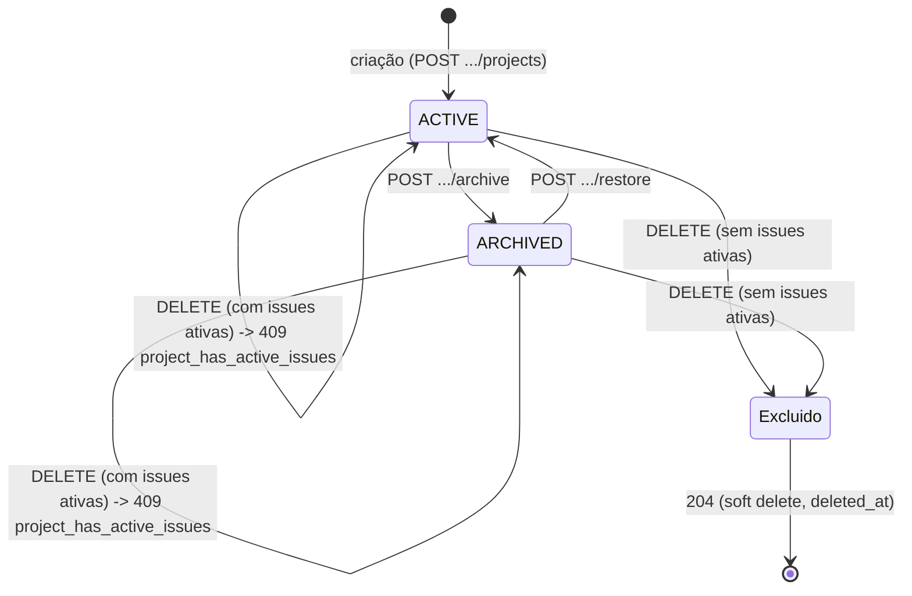

# 04 — Design da API

## 1. Convenções gerais

- **Base URL**: `/api/v1`. Versionamento vai no path (não em header) para ser visível e cacheável trivialmente — mudança incompatível de contrato nasce como `/api/v2`, o contrato anterior continua servido até deprecação formal.
- **Formato**: JSON em request e response (`Content-Type: application/json`). Datas em ISO 8601 UTC (`2026-07-13T14:30:00Z`). IDs em UUID string.
- **Envelope de resposta**: ver `CLAUDE.md` §8 (`{ data }`, `{ data, meta }` para coleções, `{ error }` para falhas).
- **Autenticação**: header `Authorization: Bearer <access_token>` em toda rota exceto `POST /auth/register`, `POST /auth/login`, `POST /auth/refresh`. Refresh token trafega apenas via cookie `HttpOnly`.
- **Autorização**: declarada por rota na tabela de cada recurso abaixo, resolvida via `Depends(require_permission(Permission.X))` (`CLAUDE.md` §10, implementado desde a Sprint 5 — `core/authorization.py`). Papéis: `OWNER > ADMIN > MEMBER > GUEST` (matriz completa por permissão em `docs/07-security.md` §8).
- **Paginação**: cursor-based para coleções de alto volume (`issues`, `activity_logs`, `notifications`) — `?cursor=<opaque>&limit=50` (default `limit=20`, máx `100`); offset-based (`?page=1&per_page=20`) para coleções pequenas e estáveis (`members`, `teams`, `labels`, `projects`) onde "ir para a página 5" é uma interação real de UI. Justificativa em ADR (ver `docs/09-decision-log.md`, nota em ADR-002): cursor evita o problema de paginação instável quando novas issues são inseridas entre páginas; offset é aceitável quando o volume é pequeno o suficiente para nunca importar.
- **Filtros**: query params nomeados por campo (`?status=in_progress&assignee_id=<uuid>&label=bug`), combináveis com AND. Múltiplos valores do mesmo campo = OR dentro do campo (`?status=todo&status=in_progress`).
- **Ordenação**: `?sort=-updated_at` (prefixo `-` = descendente). Campo default documentado por recurso.
- **Idempotência**: `POST` de criação aceita header opcional `Idempotency-Key`; requisições repetidas com a mesma chave dentro de 24h retornam a resposta original em vez de duplicar o recurso (mitigação de duplo-clique/retry de rede).
- **Concorrência otimista**: recursos versionados (`issues`) exigem `If-Match: <version>` em `PATCH`; divergência retorna `409 Conflict` (`code: "version_conflict"`).

### Códigos HTTP usados

| Código | Uso |
|---|---|
| 200 | Sucesso em leitura ou atualização |
| 201 | Criação de recurso (corpo contém o recurso criado) |
| 204 | Sucesso sem corpo (ex.: `DELETE`) |
| 400 | Requisição malformada (JSON inválido) |
| 401 | Não autenticado / token inválido ou expirado |
| 403 | Autenticado, mas sem permissão para a ação |
| 404 | Recurso não encontrado (ou existe, mas fora do workspace do usuário — nunca vazamos a distinção) |
| 409 | Conflito (duplicidade, versão otimista divergente, transição de estado inválida) |
| 422 | Corpo válido como JSON, mas falha de validação de schema |
| 429 | Rate limit excedido |
| 500 | Erro não tratado (logado, nunca detalhado ao cliente) |

## 2. Autenticação (`/auth`)

| Ação | Endpoint | Auth | Request | Response | Códigos |
|---|---|---|---|---|---|
| Registrar | `POST /auth/register` | Nenhuma | `{ name, email, password }` | `{ data: { user } }` | 201, 409 (`email_already_registered`), 422 |
| Login | `POST /auth/login` | Nenhuma | `{ email, password }` | `{ data: { access_token, user } }` + cookies `refresh_token`/`csrf_token` | 200, 401 (`invalid_credentials`), 429 |
| Refresh | `POST /auth/refresh` | Cookie `refresh_token` + header `X-CSRF-Token` | — | `{ data: { access_token } }` + rotaciona cookie `refresh_token` | 200, 401 (`invalid_refresh_token`) |
| Logout | `POST /auth/logout` | Bearer | — | 204, limpa cookies, revoga a sessão atual no banco | 204, 401 |
| Logout global | `POST /auth/logout-all` | Bearer | — | 204, limpa cookies, revoga **todas** as sessões do usuário | 204, 401 |

Regras de negócio notáveis: `register` não realiza login automático (fluxo explícito, evita ambiguidade de estado); `refresh` fora do padrão (detecção de reuso de refresh token revogado, que revoga a sessão inteira) está detalhado em `docs/07-security.md`. `GET /users/me` (perfil do usuário autenticado) vive em `/users`, não em `/auth` — ver §2.1: é um recurso (o usuário), não uma ação de autenticação.

### 2.1 Usuários (`/users`)

| Ação | Endpoint | Auth | Response | Códigos |
|---|---|---|---|---|
| Perfil próprio | `GET /users/me` | Bearer | `{ data: { user } }` | 200, 401 (`invalid_token`) |

Desde a Sprint 4, `GET /users/me` inclui `workspaces: [{ id, name, slug, role }]` — um resumo de cada workspace do qual o usuário é membro e o papel que ocupa nele (ADR-008, impacto futuro; ADR-009). Não é o `workspace` completo (sem `description`/timestamps) — só o suficiente para a UI listar/alternar entre workspaces sem uma chamada extra a `GET /workspaces`.

## 3. Workspaces (`/workspaces`)

Implementado na Sprint 4 (`docs/09-decision-log.md` ADR-009 tem o racional de cada desvio em relação ao esboço original abaixo).

| Ação | Endpoint | Autorização | Request | Response | Códigos |
|---|---|---|---|---|---|
| Criar | `POST /workspaces` | Qualquer usuário autenticado | `{ name, slug?, description? }` | `{ data: { workspace } }`, criador vira `OWNER`. `slug` omitido é gerado a partir de `name` | 201, 409 (`slug_taken`), 422 |
| Listar minhas | `GET /workspaces?page=&per_page=` | Autenticado | — | `{ data: [workspace], meta }` | 200 |
| Detalhe | `GET /workspaces/{workspace_id}` | Membro do workspace | — | `{ data: { workspace } }` | 200, 404 |
| Atualizar | `PATCH /workspaces/{workspace_id}` | `OWNER` | `{ name?, slug?, description? }` | `{ data: { workspace } }` | 200, 403, 404, 409 (`slug_taken`) |
| Excluir | `DELETE /workspaces/{workspace_id}` | `OWNER` | — | 204 (soft delete) | 204, 403, 404 |

Não-membro em `workspace_id` existente recebe **404**, nunca **403** — mesmo racional anti-enumeration do resto da API (§1: "existe, mas fora do workspace do usuário — nunca vazamos a distinção"). `403` só ocorre quando o chamador **é** membro mas não tem o papel exigido pela ação.

### Membros (`/workspaces/{workspace_id}/members`)

| Ação | Endpoint | Autorização | Request | Response | Códigos |
|---|---|---|---|---|---|
| Listar | `GET .../members?page=&per_page=&role=` | `workspace.view` (qualquer papel) | — | `{ data: [member], meta }` | 200, 404 |
| Sair | `DELETE .../members/me` | Membro (sem permissão específica) | — | 204 | 204, 404, 409 (`sole_owner_cannot_leave`) |
| Alterar papel | `PATCH .../members/{member_id}` | `member.update_role` (`OWNER`/`ADMIN`, exceto sobre outro `OWNER`) | `{ role }` (`role` ≠ `OWNER`) | `{ data: { member } }` | 200, 403 (`permission_denied`, `cannot_manage_owner`), 404 (`workspace_not_found`, `member_not_found`), 409 (`cannot_manage_own_membership`), 422 |
| Remover membro | `DELETE .../members/{member_id}` | `member.remove` (`OWNER`/`ADMIN`, exceto sobre outro `OWNER`) | — | 204 | 204, 403 (`permission_denied`, `cannot_manage_owner`), 404 (`workspace_not_found`, `member_not_found`), 409 (`cannot_manage_own_membership`) |
| Convidar | `POST .../invitations` | `workspace.invite` (`OWNER`/`ADMIN`) | `{ email, role }` (`role` ≠ `OWNER`) | `{ data: { invitation } }` — `token` em texto plano só nesta resposta (§3.2) | 201, 403, 404, 409 (`already_member`, `invitation_already_pending`) |
| Listar convites | `GET .../invitations?page=&per_page=` | `workspace.invite` (`OWNER`/`ADMIN`) | — | `{ data: [invitation], meta }` (sem `token`) | 200, 403, 404 |
| Cancelar convite | `DELETE .../invitations/{invitation_id}` | `workspace.invite` (`OWNER`/`ADMIN`) | — | 204 (soft delete) | 204, 403, 404 |
| Aceitar convite | `POST /invitations/{token}/accept` | Autenticado (e-mail deve bater) | — | `{ data: { workspace_member } }` | 200, 403 (`invitation_email_mismatch`), 404 (`invitation_not_found`), 409 (`invitation_expired`, `already_member`) |

`Alterar papel` e `Remover membro` estavam no esboço original desta seção (Sprint 0), foram adiados na Sprint 4 por dependerem de RBAC (ADR-009), e foram implementados na Sprint 5 sobre `Depends(require_permission(...))` (`docs/07-security.md` §8, `core/authorization.py`). Ambos rejeitam alvo = o próprio chamador (`409 cannot_manage_own_membership` — use `.../members/me` para sair) e um `ADMIN` mirando um `OWNER` (`403 cannot_manage_owner`). `PATCH` nunca aceita `role: "OWNER"` (`422` — transferência de propriedade é fora de escopo, ADR-010).

### 3.1 Aceitar convite é um endpoint global, não aninhado

`POST /invitations/{token}/accept` fica fora de `/workspaces/{workspace_id}/...` deliberadamente: quem aceita ainda não é membro do workspace (não tem como o cliente afirmar um `workspace_id` de forma confiável antes de aceitar), e o token opaco já resolve o workspace correto no servidor — nenhum valor de segurança extra viria de exigir o `workspace_id` na URL também. Mesmo racional de `/auth/*` viver fora de `/users/{id}/...`.

### 3.2 Convite: token em texto plano só na criação

O banco guarda apenas `token_hash` (`SHA-256`, mesmo padrão de `refresh_tokens`) — o valor em texto plano só existe no momento da criação e é devolvido uma única vez em `POST .../invitations`. Substitui o envio por e-mail transacional (fora do escopo de infraestrutura desta sprint, que não inclui um provedor de e-mail): o `OWNER`/`ADMIN` copia o token e o repassa manualmente. Nenhuma listagem subsequente (`GET .../invitations`) o expõe.

## 4. Times (`/workspaces/{workspace_id}/teams`)

| Ação | Endpoint | Autorização | Request | Response | Códigos |
|---|---|---|---|---|---|
| Criar | `POST .../teams` | `ADMIN`+ | `{ name, key }` | `{ data: { team } }` (cria workflow default) | 201, 409 (`key_taken`), 422 |
| Listar | `GET .../teams` | Membro | — | `{ data: [team], meta }` | 200 |
| Detalhe | `GET .../teams/{team_id}` | Membro do time ou `ADMIN`+ | — | `{ data: { team, workflow_states } }` | 200, 403, 404 |
| Atualizar | `PATCH .../teams/{team_id}` | `ADMIN`+ | `{ name? }` | `{ data: { team } }` | 200, 403 |
| Excluir | `DELETE .../teams/{team_id}` | `ADMIN`+ | — | 204 | 204, 403 |
| Adicionar membro | `POST .../teams/{team_id}/members` | `ADMIN`+ | `{ user_id }` | `{ data: { team_member } }` | 201, 403, 409 |
| Remover membro | `DELETE .../teams/{team_id}/members/{user_id}` | `ADMIN`+ | — | 204 | 204, 403 |
| Configurar workflow | `PUT .../teams/{team_id}/workflow-states` | `ADMIN`+ | `{ states: [{ name, category, position }] }` | `{ data: { workflow_states } }` | 200, 409 (`states_in_use`, se remoção afeta issue existente) |

## 5. Issues (`/workspaces/{workspace_id}/issues`)

| Ação | Endpoint | Autorização | Request | Response | Códigos |
|---|---|---|---|---|---|
| Criar | `POST .../issues` | Membro do time | `{ team_id, title, description?, status_id?, priority?, assignee_id?, label_ids?, project_id?, cycle_id? }` | `{ data: { issue } }` (gera `number` sequencial) | 201, 403, 404 (`team_not_found`), 422 |
| Listar/Board | `GET .../issues?team_id=&status=&assignee_id=&label=&priority=&q=&sort=&cursor=&limit=` | Membro do time | — | `{ data: [issue], meta: { next_cursor } }` | 200, 403 |
| Detalhe | `GET .../issues/{issue_id}` | Membro do time da issue | — | `{ data: { issue, labels, comments_count } }` | 200, 403, 404 |
| Atualizar | `PATCH .../issues/{issue_id}` | Membro do time (ver matriz §RBAC) | `{ title?, description?, status_id?, priority?, assignee_id?, label_ids? }` + header `If-Match` | `{ data: { issue } }` | 200, 403, 404, 409 (`version_conflict` ou `invalid_status_transition`) |
| Excluir | `DELETE .../issues/{issue_id}` | Criador ou `ADMIN`+ | — | 204 (soft delete) | 204, 403, 404 |
| Atividade | `GET .../issues/{issue_id}/activity` | Membro do time | — | `{ data: [activity_log], meta: { next_cursor } }` | 200 |

`q` no filtro de listagem aciona busca textual (índice GIN, §9 de `docs/03-database.md`); demais filtros combinam via AND. Ordenação default: `-updated_at`.

## 6. Comentários (`/workspaces/{workspace_id}/issues/{issue_id}/comments`)

| Ação | Endpoint | Autorização | Request | Response | Códigos |
|---|---|---|---|---|---|
| Criar | `POST .../comments` | Membro do time | `{ body }` | `{ data: { comment } }` | 201, 403, 404 |
| Listar | `GET .../comments?cursor=&limit=` | Membro do time | — | `{ data: [comment], meta }` | 200 |
| Atualizar | `PATCH .../comments/{comment_id}` | Autor | `{ body }` | `{ data: { comment } }` | 200, 403 |
| Excluir | `DELETE .../comments/{comment_id}` | Autor ou `ADMIN`+ | — | 204 | 204, 403 |

## 7. Labels (`/workspaces/{workspace_id}/labels`)

| Ação | Endpoint | Autorização | Request | Response | Códigos |
|---|---|---|---|---|---|
| Criar | `POST .../labels` | `MEMBER`+ | `{ name, color }` | `{ data: { label } }` | 201, 409 (`name_taken`) |
| Listar | `GET .../labels` | Membro | — | `{ data: [label], meta }` | 200 |
| Atualizar | `PATCH .../labels/{label_id}` | `ADMIN`+ | `{ name?, color? }` | `{ data: { label } }` | 200, 403 |
| Excluir | `DELETE .../labels/{label_id}` | `ADMIN`+ | — | 204 (desvincula de issues) | 204, 403 |

## 8. Projetos (`/workspaces/{workspace_id}/projects`)

Implementado na Sprint 6 (`docs/09-decision-log.md` ADR-011 tem o racional de cada decisão desta feature). Ciclos (`/teams/{team_id}/cycles`) e o join `Project ↔ Team` continuam pós-MVP — ver Sprint 8 em `docs/08-roadmap.md`.

| Ação | Endpoint | Autorização | Request | Response | Códigos |
|---|---|---|---|---|---|
| Criar | `POST .../projects` | `project.create` (`OWNER`/`ADMIN`) | `{ name, slug?, description?, icon?, color?, target_date?, lead_id? }` | `{ data: { project } }` — `slug` omitido é gerado a partir de `name` | 201, 401, 403, 404, 409 (`project_name_taken`, `project_slug_taken`), 422 |
| Listar | `GET .../projects?page=&per_page=&search=&status=&sort=` | `project.read` (qualquer papel) | — | `{ data: [project], meta }` | 200, 401, 404 |
| Detalhe | `GET .../projects/{project_id}` | `project.read` | — | `{ data: { project } }` | 200, 401, 404 (`project_not_found`) |
| Atualizar | `PATCH .../projects/{project_id}` | `project.update` (`OWNER`/`ADMIN`) | `{ name?, slug?, description?, icon?, color?, target_date?, lead_id? }` — **sem** `status` | `{ data: { project } }` | 200, 401, 403, 404, 409 (`project_name_taken`, `project_slug_taken`), 422 |
| Arquivar | `POST .../projects/{project_id}/archive` | `project.update` | — | `{ data: { project } }` (`status: "ARCHIVED"`) | 200, 401, 403, 404, 409 (`project_already_archived`) |
| Restaurar | `POST .../projects/{project_id}/restore` | `project.update` | — | `{ data: { project } }` (`status: "ACTIVE"`) | 200, 401, 403, 404, 409 (`project_not_archived`) |
| Excluir | `DELETE .../projects/{project_id}` | `project.delete` (`OWNER`/`ADMIN`) | — | 204 (soft delete) | 204, 401, 403, 404, 409 (`project_has_active_issues`) |

`status` nunca é aceito pelo `PATCH` genérico — a única forma de transicionar é `.../archive`/`.../restore`, cada um idempotency-guarded (arquivar um projeto já arquivado, ou restaurar um que não está arquivado, é `409`, nunca um no-op silencioso), para que toda mudança de estado seja intencional e auditável via `project_activity_logs`. Arquivar/restaurar/atualizar reaproveitam a mesma permissão `project.update` — não existe uma permissão dedicada para arquivar, já que quem pode editar um projeto é exatamente quem pode transicionar seu status. Não há ownership override para Projetos (ao contrário de Comentários/Issues, `docs/07-security.md` §8.5): qualquer `OWNER`/`ADMIN` gerencia qualquer projeto do workspace, não só os que criou.

### Exemplo — criar projeto

```json
// POST /workspaces/8c2e.../projects
{
  "name": "Migração de Infraestrutura",
  "description": "Mover workloads para o novo cluster.",
  "icon": "🚀",
  "color": "#4F46E5",
  "target_date": "2026-09-30"
}

// 201
{
  "data": {
    "id": "0197a1e4-...",
    "workspace_id": "8c2e...",
    "name": "Migração de Infraestrutura",
    "slug": "migracao-de-infraestrutura",
    "description": "Mover workloads para o novo cluster.",
    "icon": "🚀",
    "color": "#4F46E5",
    "status": "ACTIVE",
    "target_date": "2026-09-30",
    "lead_id": null,
    "created_by": "3fa2...",
    "created_at": "2026-07-13T19:00:00Z",
    "updated_at": "2026-07-13T19:00:00Z"
  }
}
```

### Exemplo — listar projetos

```json
// GET /workspaces/8c2e.../projects?status=ACTIVE&sort=-created_at&page=1&per_page=20
{
  "data": [
    { "id": "0197a1e4-...", "name": "Migração de Infraestrutura", "slug": "migracao-de-infraestrutura", "status": "ACTIVE", "...": "..." }
  ],
  "meta": { "page": 1, "per_page": 20, "total": 6, "total_pages": 1 }
}
```

`search` faz `ILIKE '%termo%'` case-insensitive sobre `name` (sem índice GIN dedicado — volume esperado de projetos por workspace não justifica, ao contrário da busca full-text de Issues, RF-ISSUE-09). `status` filtra por igualdade exata (`ACTIVE`/`ARCHIVED`). `sort` aceita `name|-name|created_at|-created_at|updated_at|-updated_at|target_date|-target_date`, default `-created_at`. Paginação offset-based (`docs/03-database.md` §1) — mesmo raciocínio de `members`/`teams`: um workspace tem dezenas, não milhares, de projetos.

### Fluxo de criação de projeto

```mermaid
sequenceDiagram
    participant C as Cliente
    participant R as Router
    participant Dep as require_permission
    participant S as ProjectService
    participant Repo as ProjectRepository
    participant DB as PostgreSQL

    C->>R: POST .../projects { name, slug?, ... }
    R->>R: valida ProjectCreateRequest (Pydantic)
    R->>Dep: Depends(require_permission(Permission.PROJECT_CREATE))
    alt não é membro do workspace
        Dep-->>C: 404 workspace_not_found
    else papel insuficiente (não OWNER/ADMIN)
        Dep-->>C: 403 permission_denied
    else autorizado
        Dep-->>S: WorkspaceMember do chamador
        S->>S: valida nome (2-100, trim); gera slug se ausente (core/slug.py)
        S->>Repo: nome já em uso? (case-insensitive, workspace_id)
        alt nome em uso
            Repo-->>S: conflito
            S-->>C: 409 project_name_taken
        else slug em uso (retry com sufixo aleatório, até 5x)
            Repo-->>S: conflito
            S-->>C: 409 project_slug_taken
        else livre
            S->>Repo: INSERT Project (status=ACTIVE)
            S->>Repo: INSERT ProjectActivityLog (project.created)
            Repo->>DB: commit (boundary controlado pelo service)
            S-->>C: 201 { data: project }
        end
    end
```

### Transições de estado (arquivar/restaurar/excluir)



`DELETE` é bloqueado enquanto o projeto tiver Issues ativas (não soft-deletadas) apontando para ele via `project_id` — espelha, na camada de service, a mesma política já declarada na FK `issues.project_id → projects.id` (`ON DELETE RESTRICT`), que soft delete não aciona (`docs/09-decision-log.md` ADR-011).

## 9. Notificações — pós-MVP (`/notifications`)

| Ação | Endpoint | Autorização | Response | Códigos |
|---|---|---|---|---|
| Listar | `GET /notifications?read=&cursor=&limit=` | Dono do recurso (usuário autenticado, implícito) | `{ data: [notification], meta }` | 200 |
| Marcar como lida | `PATCH /notifications/{id}` | Dono do recurso | `{ data: { notification } }` | 200, 403 |

## 10. Erros — catálogo de `code` (não exaustivo, cresce por feature)

`invalid_credentials`, `email_already_registered`, `invalid_refresh_token`, `invalid_token`, `workspace_not_found`, `slug_taken`, `already_member`, `invitation_already_pending`, `invitation_not_found`, `invitation_expired`, `invitation_email_mismatch`, `sole_owner_cannot_leave`, `member_not_found`, `cannot_manage_own_membership`, `cannot_manage_owner`, `key_taken`, `name_taken`, `team_not_found`, `issue_not_found`, `version_conflict`, `invalid_status_transition`, `permission_denied`, `rate_limited`, `validation_error`, `project_not_found`, `project_slug_taken`, `project_name_taken`, `project_already_archived`, `project_not_archived`, `project_has_active_issues`.

`project_not_found` (404), `project_slug_taken`/`project_name_taken` (409, unicidade por workspace), `project_already_archived`/`project_not_archived` (409, transição de estado idempotency-guarded) e `project_has_active_issues` (409, exclusão bloqueada) são novos na Sprint 6 (§8).

`member_not_found` (404), `cannot_manage_own_membership` (409) e `cannot_manage_owner` (403) são novos na Sprint 5 (`PATCH`/`DELETE .../members/{member_id}`) — ver `docs/07-security.md` §8.4.

`invalid_token` (401) cobre qualquer falha de validação do access token Bearer em rota protegida — ausente, malformado, expirado, ou apontando para um usuário que não existe mais (inclusive soft-deleted). Deliberadamente um único código para todo esse espectro, mesmo racional anti-enumeration do `invalid_credentials` — ver `docs/07-security.md` §10 e ADR-008.

`workspace_not_found` (404) cobre tanto workspace inexistente quanto workspace existente do qual o chamador não é membro (`docs/09-decision-log.md` ADR-009). `invitation_expired` (409, não 400 como o esboço original da Sprint 0 sugeria) cobre tanto convite expirado quanto já aceito — ambos "não pode mais ser usado"; ver ADR-009.

Todo novo `code` introduzido em uma feature deve ser adicionado a este catálogo no mesmo PR (regra também em `CLAUDE.md` §17).
