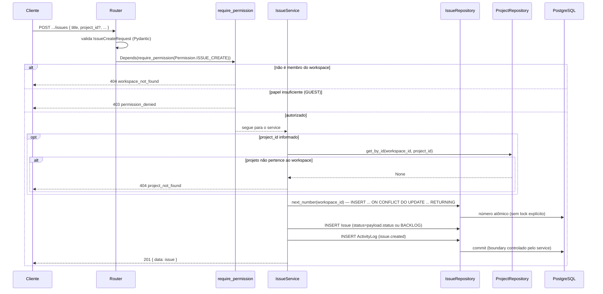
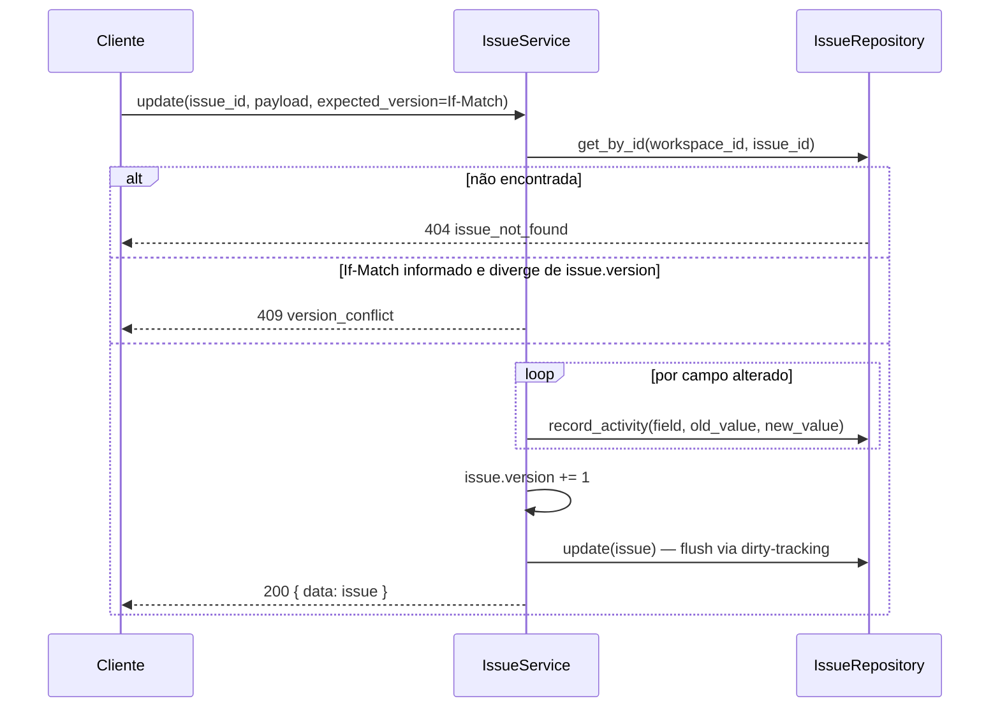
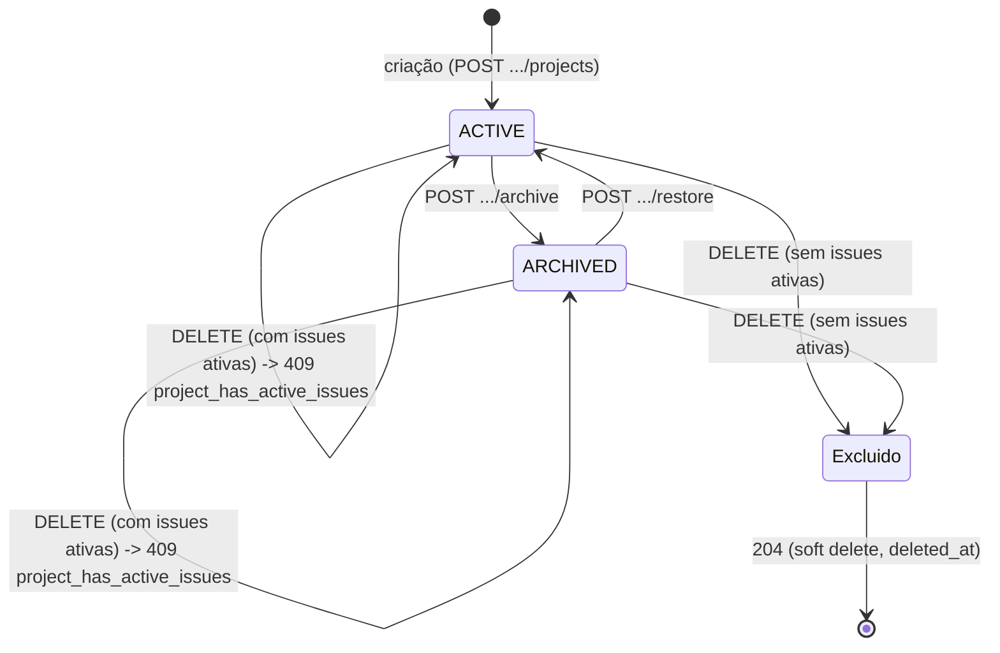

# 04 — Design da API

## 1. Convenções gerais

- **Base URL**: `/api/v1`. Versionamento vai no path (não em header) para ser visível e cacheável trivialmente — mudança incompatível de contrato nasce como `/api/v2`, o contrato anterior continua servido até deprecação formal.
- **Formato**: JSON em request e response (`Content-Type: application/json`). Datas em ISO 8601 UTC (`2026-07-13T14:30:00Z`). IDs em UUID string.
- **Envelope de resposta**: ver `CLAUDE.md` §8 (`{ data }`, `{ data, meta }` para coleções, `{ error }` para falhas).
- **Autenticação**: header `Authorization: Bearer <access_token>` em toda rota exceto `POST /auth/register`, `POST /auth/login`, `POST /auth/refresh`. Refresh token trafega apenas via cookie `HttpOnly`.
- **Autorização**: declarada por rota na tabela de cada recurso abaixo, resolvida via `Depends(require_permission(Permission.X))` (`CLAUDE.md` §10, implementado desde a Sprint 5 — `core/authorization.py`). Papéis: `OWNER > ADMIN > MEMBER > GUEST` (matriz completa por permissão em `docs/07-security.md` §8).
- **Paginação**: cursor-based para coleções de alto volume (`issues`, `activity_logs`, `notifications`) — `?cursor=<opaque>&limit=50` (default `limit=20`, máx `100`); offset-based (`?page=1&per_page=20`) para coleções pequenas e estáveis (`members`, `teams`, `labels`, `projects`) onde "ir para a página 5" é uma interação real de UI. Justificativa em ADR (ver `docs/09-decision-log.md`, nota em ADR-002): cursor evita o problema de paginação instável quando novas issues são inseridas entre páginas; offset é aceitável quando o volume é pequeno o suficiente para nunca importar.
- **Filtros**: query params nomeados por campo (`?status=in_progress&assignee_id=<uuid>&label=bug`), combináveis com AND. Múltiplos valores do mesmo campo = OR dentro do campo (`?status=todo&status=in_progress`).
- **Ordenação**: `?sort=-updated_at` (prefixo `-` = descendente). Campo default documentado por recurso.
- **Idempotência**: `POST` de criação aceita header opcional `Idempotency-Key`; requisições repetidas com a mesma chave dentro de 24h retornam a resposta original em vez de duplicar o recurso (mitigação de duplo-clique/retry de rede).
- **Concorrência otimista**: recursos versionados (`issues`) exigem `If-Match: <version>` em `PATCH`; divergência retorna `409 Conflict` (`code: "version_conflict"`).

### Códigos HTTP usados

| Código | Uso |
|---|---|
| 200 | Sucesso em leitura ou atualização |
| 201 | Criação de recurso (corpo contém o recurso criado) |
| 204 | Sucesso sem corpo (ex.: `DELETE`) |
| 400 | Requisição malformada (JSON inválido) |
| 401 | Não autenticado / token inválido ou expirado |
| 403 | Autenticado, mas sem permissão para a ação |
| 404 | Recurso não encontrado (ou existe, mas fora do workspace do usuário — nunca vazamos a distinção) |
| 409 | Conflito (duplicidade, versão otimista divergente, transição de estado inválida) |
| 422 | Corpo válido como JSON, mas falha de validação de schema |
| 429 | Rate limit excedido |
| 500 | Erro não tratado (logado, nunca detalhado ao cliente) |

## 2. Autenticação (`/auth`)

| Ação | Endpoint | Auth | Request | Response | Códigos |
|---|---|---|---|---|---|
| Registrar | `POST /auth/register` | Nenhuma | `{ name, email, password }` | `{ data: { user } }` | 201, 409 (`email_already_registered`), 422 |
| Login | `POST /auth/login` | Nenhuma | `{ email, password }` | `{ data: { access_token, user } }` + cookies `refresh_token`/`csrf_token` | 200, 401 (`invalid_credentials`), 429 |
| Refresh | `POST /auth/refresh` | Cookie `refresh_token` + header `X-CSRF-Token` | — | `{ data: { access_token } }` + rotaciona cookie `refresh_token` | 200, 401 (`invalid_refresh_token`) |
| Logout | `POST /auth/logout` | Bearer | — | 204, limpa cookies, revoga a sessão atual no banco | 204, 401 |
| Logout global | `POST /auth/logout-all` | Bearer | — | 204, limpa cookies, revoga **todas** as sessões do usuário | 204, 401 |
| Solicitar reset de senha | `POST /auth/password-reset/request` | Nenhuma | `{ email }` | 202, sempre — nunca 200/404 conforme o e-mail exista ou não (anti-enumeration, `docs/07-security.md` §10); token nunca aparece no corpo da resposta | 202, 422, 429 |
| Confirmar reset de senha | `POST /auth/password-reset/confirm` | Nenhuma | `{ token, new_password }` | 204, troca a senha e revoga todas as sessões ativas do usuário (mesmo efeito de `logout-all`) | 204, 401 (`invalid_password_reset_token`), 422, 429 |

Regras de negócio notáveis: `register` não realiza login automático (fluxo explícito, evita ambiguidade de estado); `refresh` fora do padrão (detecção de reuso de refresh token revogado, que revoga a sessão inteira) está detalhado em `docs/07-security.md`. `GET /users/me` (perfil do usuário autenticado) vive em `/users`, não em `/auth` — ver §2.1: é um recurso (o usuário), não uma ação de autenticação. `password-reset/request` (RF-AUTH-06, Sprint 9) não tem uma "resposta de sucesso" que revele existência de e-mail — o efeito real (token criado, e-mail "enviado") só é observável indiretamente; não existe infraestrutura de e-mail transacional real ainda (`core/mail.py::MailSender`, ADR-017), o token só chega a quem tem acesso ao mecanismo de envio configurado, nunca à resposta HTTP.

### 2.1 Usuários (`/users`)

| Ação | Endpoint | Auth | Response | Códigos |
|---|---|---|---|---|
| Perfil próprio | `GET /users/me` | Bearer | `{ data: { user } }` | 200, 401 (`invalid_token`) |

Desde a Sprint 4, `GET /users/me` inclui `workspaces: [{ id, name, slug, role }]` — um resumo de cada workspace do qual o usuário é membro e o papel que ocupa nele (ADR-008, impacto futuro; ADR-009). Não é o `workspace` completo (sem `description`/timestamps) — só o suficiente para a UI listar/alternar entre workspaces sem uma chamada extra a `GET /workspaces`.

## 3. Workspaces (`/workspaces`)

Implementado na Sprint 4 (`docs/09-decision-log.md` ADR-009 tem o racional de cada desvio em relação ao esboço original abaixo).

| Ação | Endpoint | Autorização | Request | Response | Códigos |
|---|---|---|---|---|---|
| Criar | `POST /workspaces` | Qualquer usuário autenticado | `{ name, slug?, description? }` | `{ data: { workspace } }`, criador vira `OWNER`. `slug` omitido é gerado a partir de `name` | 201, 409 (`slug_taken`), 422 |
| Listar minhas | `GET /workspaces?page=&per_page=` | Autenticado | — | `{ data: [workspace], meta }` | 200 |
| Detalhe | `GET /workspaces/{workspace_id}` | Membro do workspace | — | `{ data: { workspace } }` | 200, 404 |
| Atualizar | `PATCH /workspaces/{workspace_id}` | `workspace.update` (`OWNER`/`ADMIN`) | `{ name?, slug?, description? }` | `{ data: { workspace } }` | 200, 403, 404, 409 (`slug_taken`) |
| Excluir | `DELETE /workspaces/{workspace_id}` | `workspace.delete` (só `OWNER`) | — | 204 (soft delete) | 204, 403, 404 |

Não-membro em `workspace_id` existente recebe **404**, nunca **403** — mesmo racional anti-enumeration do resto da API (§1: "existe, mas fora do workspace do usuário — nunca vazamos a distinção"). `403` só ocorre quando o chamador **é** membro mas não tem o papel exigido pela ação.

`Atualizar` corrigido para `OWNER`/`ADMIN` (Sprint 12.3, M2 fase 2) — a matriz de permissões (`core/authorization.py`) sempre concedeu `ADMIN` todas as permissões exceto `WORKSPACE_DELETE`; esta tabela documentava `OWNER` como único papel autorizado a atualizar desde a redação original, uma divergência nunca corrigida (código e frontend — `WorkspaceGeneralSettings.tsx`'s `canEdit` — sempre concordaram entre si, só esta tabela estava errada).

### Membros (`/workspaces/{workspace_id}/members`)

| Ação | Endpoint | Autorização | Request | Response | Códigos |
|---|---|---|---|---|---|
| Listar | `GET .../members?page=&per_page=&role=` | `workspace.view` (qualquer papel) | — | `{ data: [member], meta }` | 200, 404 |
| Sair | `DELETE .../members/me` | Membro (sem permissão específica) | — | 204 | 204, 404, 409 (`sole_owner_cannot_leave`) |
| Alterar papel | `PATCH .../members/{member_id}` | `member.update_role` (`OWNER`/`ADMIN`, exceto sobre outro `OWNER`) | `{ role }` (`role` ≠ `OWNER`) | `{ data: { member } }` | 200, 403 (`permission_denied`, `cannot_manage_owner`), 404 (`workspace_not_found`, `member_not_found`), 409 (`cannot_manage_own_membership`), 422 |
| Remover membro | `DELETE .../members/{member_id}` | `member.remove` (`OWNER`/`ADMIN`, exceto sobre outro `OWNER`) | — | 204 | 204, 403 (`permission_denied`, `cannot_manage_owner`), 404 (`workspace_not_found`, `member_not_found`), 409 (`cannot_manage_own_membership`) |
| Convidar | `POST .../invitations` | `workspace.invite` (`OWNER`/`ADMIN`) | `{ email, role }` (`role` ≠ `OWNER`) | `{ data: { invitation } }` — `token` em texto plano só nesta resposta (§3.2) | 201, 403, 404, 409 (`already_member`, `invitation_already_pending`) |
| Listar convites | `GET .../invitations?page=&per_page=` | `workspace.invite` (`OWNER`/`ADMIN`) | — | `{ data: [invitation], meta }` (sem `token`) | 200, 403, 404 |
| Cancelar convite | `DELETE .../invitations/{invitation_id}` | `workspace.invite` (`OWNER`/`ADMIN`) | — | 204 (soft delete) | 204, 403, 404 |
| Aceitar convite | `POST /invitations/{token}/accept` | Autenticado (e-mail deve bater) | — | `{ data: { workspace_member } }` | 200, 403 (`invitation_email_mismatch`), 404 (`invitation_not_found`), 409 (`invitation_expired`, `already_member`) |

`Alterar papel` e `Remover membro` estavam no esboço original desta seção (Sprint 0), foram adiados na Sprint 4 por dependerem de RBAC (ADR-009), e foram implementados na Sprint 5 sobre `Depends(require_permission(...))` (`docs/07-security.md` §8, `core/authorization.py`). Ambos rejeitam alvo = o próprio chamador (`409 cannot_manage_own_membership` — use `.../members/me` para sair) e um `ADMIN` mirando um `OWNER` (`403 cannot_manage_owner`). `PATCH` nunca aceita `role: "OWNER"` (`422` — transferência de propriedade é fora de escopo, ADR-010).

### 3.1 Aceitar convite é um endpoint global, não aninhado

`POST /invitations/{token}/accept` fica fora de `/workspaces/{workspace_id}/...` deliberadamente: quem aceita ainda não é membro do workspace (não tem como o cliente afirmar um `workspace_id` de forma confiável antes de aceitar), e o token opaco já resolve o workspace correto no servidor — nenhum valor de segurança extra viria de exigir o `workspace_id` na URL também. Mesmo racional de `/auth/*` viver fora de `/users/{id}/...`.

### 3.2 Convite: token em texto plano só na criação

O banco guarda apenas `token_hash` (`SHA-256`, mesmo padrão de `refresh_tokens`) — o valor em texto plano só existe no momento da criação e é devolvido uma única vez em `POST .../invitations`. Substitui o envio por e-mail transacional (fora do escopo de infraestrutura desta sprint, que não inclui um provedor de e-mail): o `OWNER`/`ADMIN` copia o token e o repassa manualmente. Nenhuma listagem subsequente (`GET .../invitations`) o expõe.

## 4. Times (`/workspaces/{workspace_id}/teams`)

| Ação | Endpoint | Autorização | Request | Response | Códigos |
|---|---|---|---|---|---|
| Criar | `POST .../teams` | `ADMIN`+ | `{ name, key }` | `{ data: { team } }` (cria workflow default) | 201, 409 (`key_taken`), 422 |
| Listar | `GET .../teams` | Membro | — | `{ data: [team], meta }` | 200 |
| Detalhe | `GET .../teams/{team_id}` | Membro do time ou `ADMIN`+ | — | `{ data: { team, workflow_states } }` | 200, 403, 404 |
| Atualizar | `PATCH .../teams/{team_id}` | `ADMIN`+ | `{ name? }` | `{ data: { team } }` | 200, 403 |
| Excluir | `DELETE .../teams/{team_id}` | `ADMIN`+ | — | 204 | 204, 403 |
| Adicionar membro | `POST .../teams/{team_id}/members` | `ADMIN`+ | `{ user_id }` | `{ data: { team_member } }` | 201, 403, 409 |
| Remover membro | `DELETE .../teams/{team_id}/members/{user_id}` | `ADMIN`+ | — | 204 | 204, 403 |
| Configurar workflow | `PUT .../teams/{team_id}/workflow-states` | `ADMIN`+ | `{ states: [{ name, category, position }] }` | `{ data: { workflow_states } }` | 200, 409 (`states_in_use`, se remoção afeta issue existente) |

## 5. Issues (`/workspaces/{workspace_id}/issues`)

Implementado na Sprint 7 (`docs/09-decision-log.md` ADR-012 tem o racional completo dos desvios em relação ao esboço original abaixo — o principal sendo o desacoplamento de `Team`/`WorkflowState`, nunca implementados como feature).

| Ação | Endpoint | Autorização | Request | Response | Códigos |
|---|---|---|---|---|---|
| Criar | `POST .../issues` | `issue.create` (`MEMBER`+) | `{ title, description?, project_id?, status?, priority?, assignee_id?, estimate?, due_date? }` | `{ data: { issue } }` (gera `number`/`identifier` sequencial por workspace, ex. `FD-1`) | 201, 401, 403, 404 (`project_not_found`, se `project_id` não pertence ao workspace), 422 |
| Listar | `GET .../issues?page=&per_page=&status=&priority=&project_id=&assignee_id=&creator_id=&q=&sort=` | `issue.read` (qualquer papel) | — | `{ data: [issue], meta }` | 200, 401, 404 |
| Detalhe | `GET .../issues/{issue_id}` | `issue.read` | — | `{ data: { issue } }` | 200, 401, 404 (`issue_not_found`) |
| Atualizar | `PATCH .../issues/{issue_id}` | `issue.update` (`MEMBER`+, sem restrição de posse) | `{ title?, description?, project_id?, status?, priority?, assignee_id?, estimate?, due_date? }` + header opcional `If-Match: <version>` | `{ data: { issue } }` | 200, 401, 403, 404, 409 (`version_conflict`, se `If-Match` divergir da versão atual), 422 |
| Excluir | `DELETE .../issues/{issue_id}` | `issue.delete` (Criador da issue **ou** `ADMIN`+ — posse-como-exceção) | — | 204 (soft delete) | 204, 401, 403, 404 |
| Atividade | `GET .../issues/{issue_id}/activity` | `issue.read` | — | `{ data: [activity_log] }` | 200, 401, 404 |

`q` aciona busca textual full-text (índice GIN, §9 de `docs/03-database.md`) sobre título/descrição; se o termo casar com o padrão `FD-\d+` ou um número puro, também compara contra `number` diretamente (busca por identificador). Demais filtros (`status`, `priority`, `project_id`, `assignee_id`, `creator_id`) combinam via AND, valor único por campo (sem OR multi-valor nesta sprint — YAGNI, `CLAUDE.md` §1.6). `sort` aceita `number|-number|created_at|-created_at|updated_at|-updated_at|priority|-priority|due_date|-due_date` (prioridade ordenada por rank semântico — `NO_PRIORITY < LOW < MEDIUM < HIGH < URGENT` —, não alfabeticamente), default `-updated_at`. Paginação **offset-based** (`{ page, per_page, total, total_pages }`, mesmo envelope de Projects/Members/Teams) — desvio deliberado do esboço original (cursor-based); ver ADR-012 Decisão 5.

`status` aceita `PATCH` genérico (ao contrário de `Project.status`, que só transiciona via `/archive`/`/restore`): mudança de status de issue é uma ação frequente e não tem workflow configurável nesta sprint, então não há transição inválida a bloquear — qualquer status pode ir para qualquer status.

### Exemplo — criar issue

```json
// POST /workspaces/8c2e.../issues
{
  "title": "Corrigir vazamento de memória no worker",
  "description": "O worker de background acumula memória após 24h em produção.",
  "priority": "HIGH",
  "status": "IN_PROGRESS",
  "estimate": 5
}

// 201
{
  "data": {
    "id": "019f6103-...",
    "workspace_id": "8c2e...",
    "project_id": null,
    "identifier": "FD-1",
    "number": 1,
    "title": "Corrigir vazamento de memória no worker",
    "description": "O worker de background acumula memória após 24h em produção.",
    "status": "IN_PROGRESS",
    "priority": "HIGH",
    "assignee_id": null,
    "creator_id": "3fa2...",
    "estimate": 5,
    "due_date": null,
    "version": 1,
    "created_at": "2026-07-14T11:24:35Z",
    "updated_at": "2026-07-14T11:24:35Z"
  }
}
```

### Identificador (`FD-{number}`)

Único por **workspace** (não por projeto): `Issue.project_id` é opcional, então "único por projeto" deixaria issues sem projeto sem um escopo claro de unicidade. `number` é um inteiro sequencial gerado atomicamente por `WorkspaceIssueCounter` (`docs/03-database.md` §6.3/§8), nunca reciclado mesmo após soft delete. `identifier` é derivado (`f"FD-{number}"`), não uma coluna própria — `"FD"` é um prefixo fixo (não customizável por workspace nesta sprint): como o identificador só precisa ser único *dentro* do workspace em que é exibido, dois workspaces mostrarem `FD-1` cada um não é uma colisão real, mesmo raciocínio de dois times diferentes usarem o mesmo texto de e-mail em contas distintas.

### Fluxo de criação de issue



### Atualização com concorrência otimista



Cada campo alterado gera uma entrada própria em `activity_logs` (`field`/`old_value`/`new_value`) — uma atualização com múltiplos campos gera múltiplas entradas na mesma transação, não uma única entrada agregada (ao contrário de `ProjectActivityLog`/`WorkspaceActivityLog`, que usam `metadata JSONB` livre por evento) — mesmo formato de diff já modelado para `ActivityLog` desde a Sprint 2.

### Exclusão: posse como exceção

`DELETE .../issues/{issue_id}` usa `Depends(require_permission(Permission.ISSUE_READ))` no router (garante só membership do workspace) — a permissão real (`Permission.ISSUE_DELETE`, que está em `OWNERSHIP_OVERRIDE_PERMISSIONS` desde a Sprint 5/ADR-010) é resolvida dentro do `IssueService.delete()`, depois de buscar a issue e conhecer `creator_id`. Um `MEMBER` que não é o criador recebe `403 permission_denied`; o criador ou qualquer `ADMIN`+/`OWNER` pode excluir.

## 6. Comentários (`/workspaces/{workspace_id}/issues/{issue_id}/comments`)

Implementado na Sprint 8 (`docs/09-decision-log.md` ADR-013 tem o racional completo dos desvios em relação ao esboço original acima).

| Ação | Endpoint | Autorização | Request | Response | Códigos |
|---|---|---|---|---|---|
| Criar | `POST .../issues/{issue_id}/comments` | `comment.create` (`MEMBER`+, incl. `GUEST`) | `{ body }` | `{ data: { comment } }` | 201, 401, 403, 404 (`issue_not_found`), 422 |
| Listar | `GET .../issues/{issue_id}/comments?page=&per_page=` | `issue.read` (qualquer papel) | — | `{ data: [comment], meta }` | 200, 401, 404 |
| Atualizar | `PATCH /workspaces/{workspace_id}/comments/{comment_id}` | `comment.update` (Autor **ou** `ADMIN`+ — posse-como-exceção) | `{ body }` | `{ data: { comment } }` | 200, 401, 403, 404, 422 |
| Excluir | `DELETE /workspaces/{workspace_id}/comments/{comment_id}` | `comment.delete` (Autor **ou** `ADMIN`+) | — | 204 | 204, 401, 403, 404 |

`PATCH`/`DELETE` não são aninhados sob `.../issues/{issue_id}` — o próprio `comment_id` se autoidentifica, mesma assimetria de path já aceita por `invitations_router` (ADR-009, Decisão 6); a permissão de posse é resolvida dentro do service (não no `Depends` da rota), mesmo padrão de `issue.delete` (ADR-012, Decisão 6). Paginação **offset-based** (`{ page, per_page, total, total_pages }`), não cursor como o esboço original sugeria — mesmo racional de Issues (ADR-012, Decisão 5): volume de comentários por issue é pequeno o suficiente para nunca tornar `OFFSET` custoso.

`mentioned_user_ids` no response é derivado das menções `@local-part-do-email` detectadas no `body` (ex.: `@joao.silva`, casando com `joao.silva@empresa.com`) — ver ADR-013 para o racional completo da sintaxe de menção e por que nenhuma notificação é disparada ainda nesta sprint (detecção/armazenamento são o escopo; envio fica para a sprint de notificações). Toda mutação de comentário (criação, edição, exclusão) gera uma entrada na `ActivityLog` da **Issue-mãe** — comentários não têm timeline própria.

## 7. Labels (`/workspaces/{workspace_id}/labels`)

Implementado na Sprint 8 (ADR-013).

| Ação | Endpoint | Autorização | Request | Response | Códigos |
|---|---|---|---|---|---|
| Criar | `POST .../labels` | `label.create` (`MEMBER`+, incl. `GUEST`) | `{ name, color, description? }` | `{ data: { label } }` | 201, 401, 403, 409 (`label_name_taken`), 422 |
| Listar | `GET .../labels` | `label.read` (qualquer papel) | — | `{ data: [label] }` (sem paginação — coleção pequena por workspace) | 200, 401 |
| Detalhe | `GET .../labels/{label_id}` | `label.read` | — | `{ data: { label } }` | 200, 401, 404 |
| Atualizar | `PATCH .../labels/{label_id}` | `label.update` (`ADMIN`+, sem posse-como-exceção) | `{ name?, color?, description? }` | `{ data: { label } }` | 200, 401, 403, 404, 409, 422 |
| Excluir | `DELETE .../labels/{label_id}` | `label.delete` (`ADMIN`+) | — | 204 (desvincula de issues via `ON DELETE CASCADE` em `issue_labels`) | 204, 401, 403, 404 |

`color` é validado como hex (`^#(?:[0-9A-Fa-f]{3}|[0-9A-Fa-f]{6})$`, `core/validators.py::validate_hex_color` — extraído de `Project` na Sprint 6 para reuso entre as duas features, ver ADR-013). `description` é opcional, até 280 caracteres. Diferente de comentário/anexo, editar ou excluir uma label **não** tem posse-como-exceção — só `ADMIN`+, por ser um recurso compartilhado do workspace, não de quem a criou (ADR-013).

### Labels de uma issue (`/workspaces/{workspace_id}/issues/{issue_id}/labels`)

| Ação | Endpoint | Autorização | Request | Response | Códigos |
|---|---|---|---|---|---|
| Listar | `GET .../issues/{issue_id}/labels` | `issue.read` | — | `{ data: [label] }` | 200, 401, 404 |
| Aplicar | `POST .../issues/{issue_id}/labels` | `issue.update` (`MEMBER`+) | `{ label_id }` | `{ data: { label } }` | 201, 401, 403, 404, 422 |
| Remover | `DELETE .../issues/{issue_id}/labels/{label_id}` | `issue.update` | — | 204 | 204, 401, 403, 404 |

Aplicar/remover uma label de uma issue gera `label.added`/`label.removed` na `ActivityLog` da issue (não em `LabelActivityLog`, que audita só o ciclo de vida do próprio Label — ver `docs/03-database.md` §6.4).

## 8. Anexos (`/workspaces/{workspace_id}/issues/{issue_id}/attachments`)

Implementado na Sprint 8 (ADR-013). Só suporta anexar a uma **Issue** nesta sprint — `Attachment.comment_id` já modela um alvo alternativo (polimorfismo pré-existente desde a Sprint 2), mas anexar diretamente a um comentário fica para quando o enunciado pedir (ver ADR-013, "Impacto futuro").

| Ação | Endpoint | Autorização | Request | Response | Códigos |
|---|---|---|---|---|---|
| Enviar | `POST .../issues/{issue_id}/attachments` | `attachment.create` (`MEMBER`+, incl. `GUEST`) | `multipart/form-data`, campo `file` | `{ data: { attachment } }` | 201, 401, 403, 404 (`issue_not_found`), 422 (`attachment_too_large`, `attachment_type_not_allowed`) |
| Listar | `GET .../issues/{issue_id}/attachments` | `issue.read` | — | `{ data: [attachment] }` | 200, 401, 404 |
| Baixar | `GET /workspaces/{workspace_id}/attachments/{attachment_id}` | `issue.read` | — | binário (`FileResponse`, `Content-Type` original) | 200, 401, 404 (`attachment_not_found`) |
| Excluir | `DELETE /workspaces/{workspace_id}/attachments/{attachment_id}` | `attachment.delete` (Uploader **ou** `ADMIN`+ — posse-como-exceção) | — | 204 | 204, 401, 403, 404 |

Teto de 10 MB por arquivo e lista branca de `Content-Type` (imagens comuns + PDF + texto — não extensão de arquivo, facilmente forjável), ambos configuráveis via `Settings` (`core/config.py`). O download não é um link estático: como o access token só existe em memória no frontend (`CLAUDE.md` §11, nunca `localStorage`/cookie), o cliente busca o arquivo via `httpClient` autenticado (`responseType: "blob"`) e dispara o download client-side — uma âncora HTML apontando direto para a rota não carregaria o header `Authorization`.

`storage_key` é um ponteiro opaco (nunca exposto na API) para o `StorageProvider` configurado; `storage_provider` no response identifica qual implementação persistiu o arquivo (`"local"` nesta sprint — `core/storage.py::LocalStorageProvider`, disco local sob `var/uploads/`). Ver ADR-013 para o racional completo do ponto de extensão para S3/blob storage equivalente no futuro.

## 9. Projetos (`/workspaces/{workspace_id}/projects`)

Implementado na Sprint 6 (`docs/09-decision-log.md` ADR-011 tem o racional de cada decisão desta feature). Ciclos (`/teams/{team_id}/cycles`) e o join `Project ↔ Team` continuam pós-MVP — ver Sprint 8 em `docs/08-roadmap.md`.

| Ação | Endpoint | Autorização | Request | Response | Códigos |
|---|---|---|---|---|---|
| Criar | `POST .../projects` | `project.create` (`OWNER`/`ADMIN`) | `{ name, slug?, description?, icon?, color?, target_date?, lead_id? }` | `{ data: { project } }` — `slug` omitido é gerado a partir de `name` | 201, 401, 403, 404, 409 (`project_name_taken`, `project_slug_taken`), 422 |
| Listar | `GET .../projects?page=&per_page=&search=&status=&sort=` | `project.read` (qualquer papel) | — | `{ data: [project], meta }` | 200, 401, 404 |
| Detalhe | `GET .../projects/{project_id}` | `project.read` | — | `{ data: { project } }` | 200, 401, 404 (`project_not_found`) |
| Atualizar | `PATCH .../projects/{project_id}` | `project.update` (`OWNER`/`ADMIN`) | `{ name?, slug?, description?, icon?, color?, target_date?, lead_id? }` — **sem** `status` | `{ data: { project } }` | 200, 401, 403, 404, 409 (`project_name_taken`, `project_slug_taken`), 422 |
| Arquivar | `POST .../projects/{project_id}/archive` | `project.update` | — | `{ data: { project } }` (`status: "ARCHIVED"`) | 200, 401, 403, 404, 409 (`project_already_archived`) |
| Restaurar | `POST .../projects/{project_id}/restore` | `project.update` | — | `{ data: { project } }` (`status: "ACTIVE"`) | 200, 401, 403, 404, 409 (`project_not_archived`) |
| Excluir | `DELETE .../projects/{project_id}` | `project.delete` (`OWNER`/`ADMIN`) | — | 204 (soft delete) | 204, 401, 403, 404, 409 (`project_has_active_issues`) |

`status` nunca é aceito pelo `PATCH` genérico — a única forma de transicionar é `.../archive`/`.../restore`, cada um idempotency-guarded (arquivar um projeto já arquivado, ou restaurar um que não está arquivado, é `409`, nunca um no-op silencioso), para que toda mudança de estado seja intencional e auditável via `project_activity_logs`. Arquivar/restaurar/atualizar reaproveitam a mesma permissão `project.update` — não existe uma permissão dedicada para arquivar, já que quem pode editar um projeto é exatamente quem pode transicionar seu status. Não há ownership override para Projetos (ao contrário de Comentários/Issues, `docs/07-security.md` §8.5): qualquer `OWNER`/`ADMIN` gerencia qualquer projeto do workspace, não só os que criou.

### Exemplo — criar projeto

```json
// POST /workspaces/8c2e.../projects
{
  "name": "Migração de Infraestrutura",
  "description": "Mover workloads para o novo cluster.",
  "icon": "🚀",
  "color": "#4F46E5",
  "target_date": "2026-09-30"
}

// 201
{
  "data": {
    "id": "0197a1e4-...",
    "workspace_id": "8c2e...",
    "name": "Migração de Infraestrutura",
    "slug": "migracao-de-infraestrutura",
    "description": "Mover workloads para o novo cluster.",
    "icon": "🚀",
    "color": "#4F46E5",
    "status": "ACTIVE",
    "target_date": "2026-09-30",
    "lead_id": null,
    "created_by": "3fa2...",
    "created_at": "2026-07-13T19:00:00Z",
    "updated_at": "2026-07-13T19:00:00Z"
  }
}
```

### Exemplo — listar projetos

```json
// GET /workspaces/8c2e.../projects?status=ACTIVE&sort=-created_at&page=1&per_page=20
{
  "data": [
    { "id": "0197a1e4-...", "name": "Migração de Infraestrutura", "slug": "migracao-de-infraestrutura", "status": "ACTIVE", "...": "..." }
  ],
  "meta": { "page": 1, "per_page": 20, "total": 6, "total_pages": 1 }
}
```

`search` faz `ILIKE '%termo%'` case-insensitive sobre `name` (sem índice GIN dedicado — volume esperado de projetos por workspace não justifica, ao contrário da busca full-text de Issues, RF-ISSUE-09). `status` filtra por igualdade exata (`ACTIVE`/`ARCHIVED`). `sort` aceita `name|-name|created_at|-created_at|updated_at|-updated_at|target_date|-target_date`, default `-created_at`. Paginação offset-based (`docs/03-database.md` §1) — mesmo raciocínio de `members`/`teams`: um workspace tem dezenas, não milhares, de projetos.

### Fluxo de criação de projeto

```mermaid
sequenceDiagram
    participant C as Cliente
    participant R as Router
    participant Dep as require_permission
    participant S as ProjectService
    participant Repo as ProjectRepository
    participant DB as PostgreSQL

    C->>R: POST .../projects { name, slug?, ... }
    R->>R: valida ProjectCreateRequest (Pydantic)
    R->>Dep: Depends(require_permission(Permission.PROJECT_CREATE))
    alt não é membro do workspace
        Dep-->>C: 404 workspace_not_found
    else papel insuficiente (não OWNER/ADMIN)
        Dep-->>C: 403 permission_denied
    else autorizado
        Dep-->>S: WorkspaceMember do chamador
        S->>S: valida nome (2-100, trim); gera slug se ausente (core/slug.py)
        S->>Repo: nome já em uso? (case-insensitive, workspace_id)
        alt nome em uso
            Repo-->>S: conflito
            S-->>C: 409 project_name_taken
        else slug em uso (retry com sufixo aleatório, até 5x)
            Repo-->>S: conflito
            S-->>C: 409 project_slug_taken
        else livre
            S->>Repo: INSERT Project (status=ACTIVE)
            S->>Repo: INSERT ProjectActivityLog (project.created)
            Repo->>DB: commit (boundary controlado pelo service)
            S-->>C: 201 { data: project }
        end
    end
```

### Transições de estado (arquivar/restaurar/excluir)



`DELETE` é bloqueado enquanto o projeto tiver Issues ativas (não soft-deletadas) apontando para ele via `project_id` — espelha, na camada de service, a mesma política já declarada na FK `issues.project_id → projects.id` (`ON DELETE RESTRICT`), que soft delete não aciona (`docs/09-decision-log.md` ADR-011).

## 10. Notificações (`/notifications`)

Implementado na Sprint 9 fase 1 (`docs/09-decision-log.md` ADR-017) e consumido pelo frontend desde a Sprint 10 (`TopbarNotifications`) e Sprint 12.6 (`RecentActivityWidget` do Dashboard) — o rótulo "pós-MVP" que este título carregava foi removido por não refletir mais o estado real da feature.

| Ação | Endpoint | Autorização | Response | Códigos |
|---|---|---|---|---|
| Listar | `GET /notifications?read=&page=&per_page=` | Dono do recurso (usuário autenticado, implícito) | `{ data: [notification], meta }` | 200 |
| Marcar como lida | `PATCH /notifications/{id}` | Dono do recurso | `{ data: { notification } }` | 200, 403, 404 |
| Marcar todas como lidas | `POST /notifications/mark-all-read` | Dono do recurso (usuário autenticado, implícito) | — | 204 |

Paginação **offset-based** (`{ page, per_page, total, total_pages }`, mesmo envelope de Projects/Members/Teams) — a implementação real (`features/notifications/router.py`) nunca seguiu a regra geral de §1 (que classifica `notifications` como candidata a cursor-based por volume); divergência não percebida até a auditoria de gap do M4 (ADR-027) porque nenhuma sprint revisitou esta seção desde a criação. Documentado aqui como o contrato real e definitivo — migrar para cursor-based fica como candidato futuro (`docs/08-roadmap.md`, "Sprint 15+") caso o volume por usuário algum dia justifique, não antecipado sem esse gatilho (`CLAUDE.md` §1.6).

## 11. Erros — catálogo de `code` (não exaustivo, cresce por feature)

`invalid_credentials`, `email_already_registered`, `invalid_refresh_token`, `invalid_password_reset_token`, `invalid_token`, `workspace_not_found`, `slug_taken`, `already_member`, `invitation_already_pending`, `invitation_not_found`, `invitation_expired`, `invitation_email_mismatch`, `sole_owner_cannot_leave`, `member_not_found`, `cannot_manage_own_membership`, `cannot_manage_owner`, `key_taken`, `name_taken`, `team_not_found`, `issue_not_found`, `version_conflict`, `permission_denied`, `rate_limited`, `validation_error`, `project_not_found`, `project_slug_taken`, `project_name_taken`, `project_already_archived`, `project_not_archived`, `project_has_active_issues`, `comment_not_found`, `label_not_found`, `label_name_taken`, `attachment_not_found`, `attachment_too_large`, `attachment_type_not_allowed`, `notification_not_found`.

`comment_not_found` (404), `label_not_found` (404), `label_name_taken` (409, unicidade por workspace), `attachment_not_found` (404), `attachment_too_large`/`attachment_type_not_allowed` (422, validados antes da persistência) são novos na Sprint 8 (§6–8, ADR-013). O esboço original deste catálogo já reservava `name_taken` genérico para labels; `label_name_taken` o substitui com um `code` específico por feature, mesmo padrão já usado por `project_name_taken` na Sprint 6 (evita que o cliente precise inferir o recurso a partir só do `code` genérico).

`project_not_found` (404), `project_slug_taken`/`project_name_taken` (409, unicidade por workspace), `project_already_archived`/`project_not_archived` (409, transição de estado idempotency-guarded) e `project_has_active_issues` (409, exclusão bloqueada) são novos na Sprint 6 (§9).

`issue_not_found` (404) e `version_conflict` (409, `If-Match` divergente) são efetivamente implementados na Sprint 7 (§5) — ambos já estavam reservados neste catálogo desde o esboço original da Sprint 0/2, sem uso até agora. `team_not_found` permanece reservado, sem uso: seria acionado por uma futura feature de Team (ainda sem service/router, ver ADR-012), não por Issues, que não depende mais de `team_id`. `invalid_status_transition` (também reservado desde o esboço original) **não** foi implementado nesta sprint e foi removido deste catálogo — `Issue.status` é um enum fixo sem grafo de transição configurável (nenhuma regra de negócio bloqueia uma mudança de status para outra), ver ADR-012 Decisão 1; o código volta ao catálogo se/quando um workflow configurável for implementado.

`member_not_found` (404), `cannot_manage_own_membership` (409) e `cannot_manage_owner` (403) são novos na Sprint 5 (`PATCH`/`DELETE .../members/{member_id}`) — ver `docs/07-security.md` §8.4.

`notification_not_found` (404) é implementado desde a Sprint 9 fase 1 (`features/notifications/exceptions.py`) mas nunca havia sido adicionado a este catálogo nem à tabela de §10 — corrigido na auditoria de gap do M4 (ADR-027).

`invalid_token` (401) cobre qualquer falha de validação do access token Bearer em rota protegida — ausente, malformado, expirado, ou apontando para um usuário que não existe mais (inclusive soft-deleted). Deliberadamente um único código para todo esse espectro, mesmo racional anti-enumeration do `invalid_credentials` — ver `docs/07-security.md` §10 e ADR-008.

`workspace_not_found` (404) cobre tanto workspace inexistente quanto workspace existente do qual o chamador não é membro (`docs/09-decision-log.md` ADR-009). `invitation_expired` (409, não 400 como o esboço original da Sprint 0 sugeria) cobre tanto convite expirado quanto já aceito — ambos "não pode mais ser usado"; ver ADR-009.

Todo novo `code` introduzido em uma feature deve ser adicionado a este catálogo no mesmo PR (regra também em `CLAUDE.md` §17).
