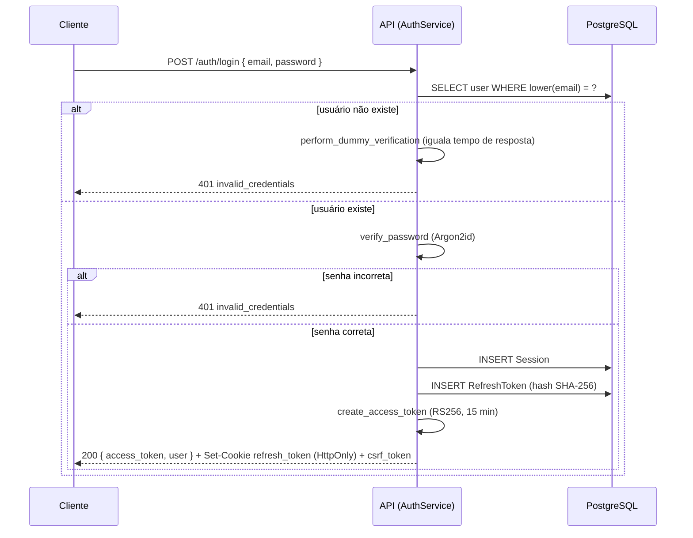
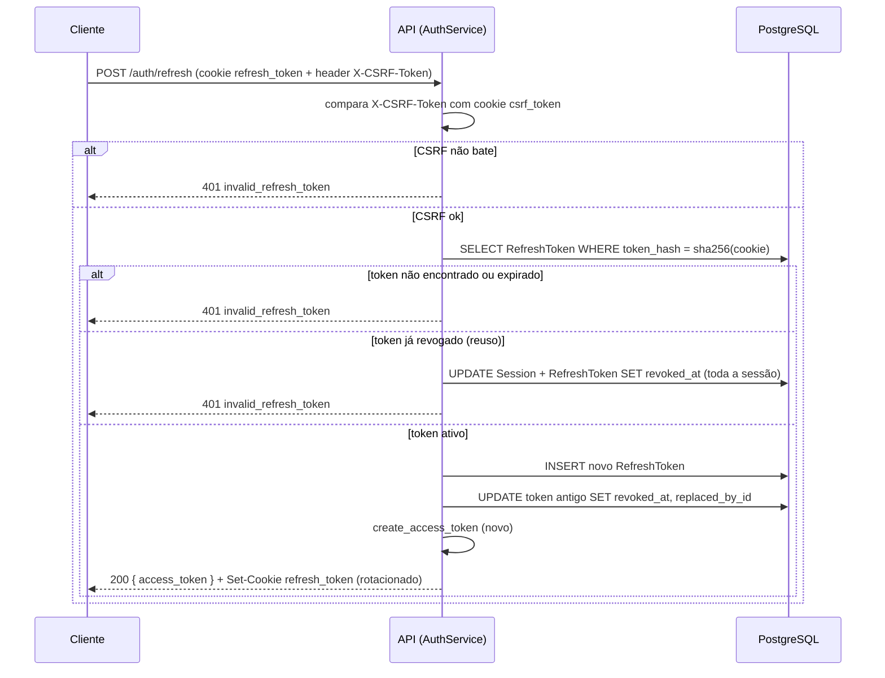
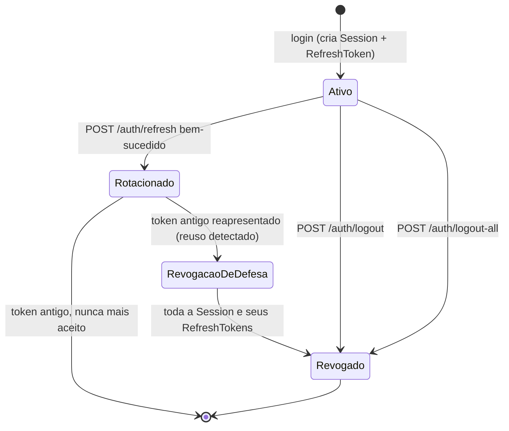
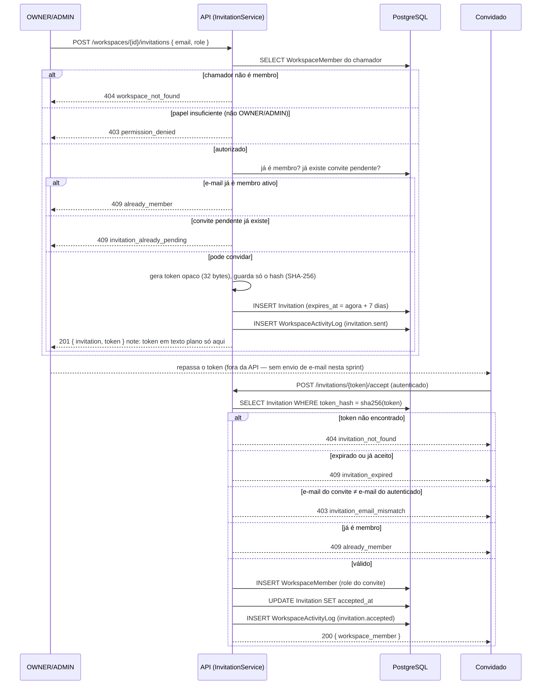
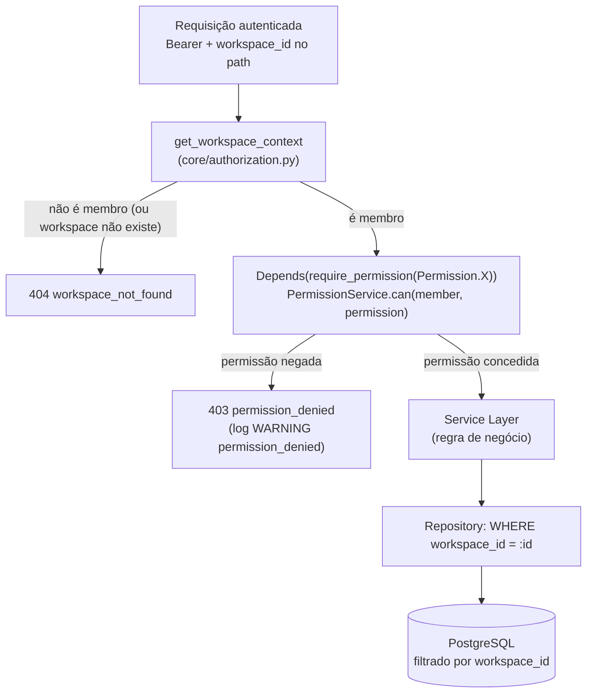
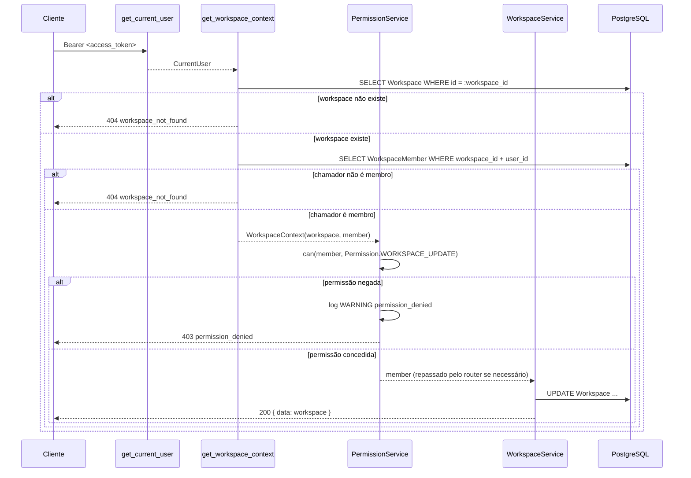
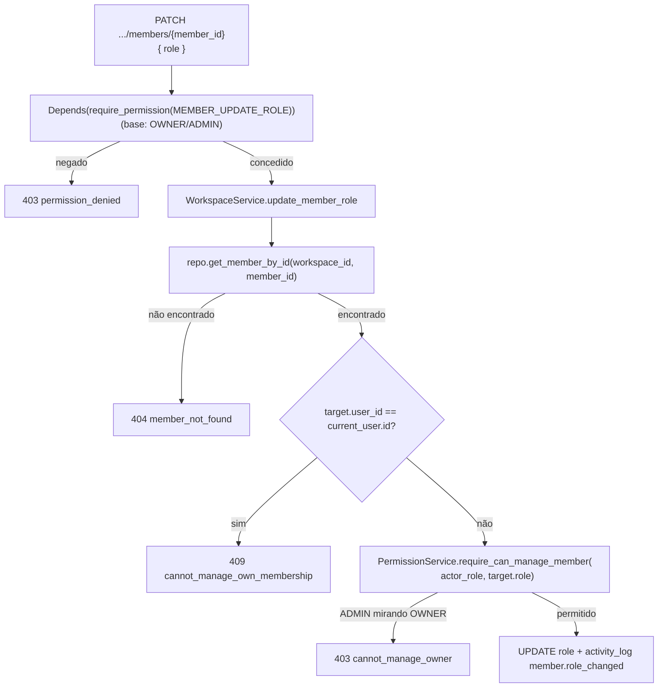

# 07 — Segurança

## 1. JWT (Access Token)

- Algoritmo `RS256` (par de chaves assimétrico), vida útil **15 minutos**. Curto de propósito: se um access token vazar (XSS, log acidental), a janela de exploração é pequena; a curta duração é o motivo pelo qual o refresh token existe (renovar sem forçar login a cada 15 min).
- Claims: `sub` (user_id), `iat`, `exp`, `jti` (identificador único do token, usado para blocklist pontual em Redis no caso raro de precisar revogar um access token específico antes da expiração — ex.: usuário reporta comprometimento). O `jti` já é gerado e está presente em todo token emitido (Sprint 3); a checagem ativa contra uma blocklist em Redis **não** está implementada ainda — logout hoje revoga a sessão/refresh token, e o access token remanescente expira sozinho em até 15 min, trade-off aceito explicitamente (ver ADR-008; **reafirmado** na auditoria completa da Sprint 14.6, ADR-032 — decisão explícita do usuário de manter, não implementar).
- Nunca embute papel/permissão (ver `docs/06-backend.md` §7) — permissão é sempre revalidada contra o banco a cada requisição.
- Transportado via header `Authorization: Bearer`, nunca em query string (evita vazamento via log de acesso/proxy).

## 2. Refresh Token

- Token opaco (não JWT), alta entropia, gerado com `secrets.token_urlsafe(32)`. O que é armazenado no banco é o **hash** do token (SHA-256), nunca o valor em texto plano — se o banco vazar, os tokens não são diretamente utilizáveis.
- Vida útil 30 dias, renovado (rotacionado) a cada uso: todo `POST /auth/refresh` bem-sucedido invalida o token usado e emite um novo, mantendo uma cadeia (`replaced_by_id`) para detecção de reuso.
- **Detecção de reuso**: se um refresh token já rotacionado (que não deveria mais existir como "ativo") for apresentado novamente, isso indica que o token pode ter sido roubado e já usado por um atacante — o sistema revoga **toda a cadeia** de tokens daquele usuário/dispositivo e força novo login. Este é o motivo central de rotacionar em vez de reusar o mesmo refresh token por 30 dias inteiros.
- Armazenado em cookie `HttpOnly; Secure; SameSite=Strict; Path=/api/v1/auth`. `HttpOnly` impede leitura via JavaScript (mitiga XSS); `Path` restrito reduz superfície de envio do cookie a apenas as rotas que precisam dele.

## 3. Cookies HttpOnly e por que o Access Token NÃO fica em cookie

Decisão deliberada: o **access token** vive em memória no frontend (variável de módulo), não em cookie. Se estivesse em cookie (mesmo `HttpOnly`), toda requisição à API o enviaria automaticamente, tornando a aplicação vulnerável a CSRF em **todas** as rotas mutáveis, não apenas em `/auth/refresh`. Mantendo o access token fora de cookie, CSRF só precisa ser mitigado no único endpoint que de fato depende de cookie de autenticação (`/auth/refresh`) — superfície de proteção mínima necessária, não máxima por precaução genérica.

Trade-off aceito: em caso de XSS bem-sucedido, o atacante pode ler o access token em memória (mas não o refresh token, que é `HttpOnly`) — limita o dano à janela de 15 minutos do access token comprometido, não a 30 dias. **Reafirmado** na auditoria completa da Sprint 14.6 (ADR-032) — decisão arquitetural, não incremental; fechar exigiria redesenhar autenticação, não ajustar um parâmetro.

## 4. CSRF

Aplica-se apenas a `POST /auth/refresh` (única rota que depende de cookie para autenticar). Estratégia: **double-submit cookie** — um cookie adicional, não-`HttpOnly` (`csrf_token`), é emitido no login; o frontend lê esse valor e o envia em um header customizado (`X-CSRF-Token`) em toda chamada a `/auth/refresh`. O backend compara header e cookie; JavaScript malicioso em outra origem não consegue ler o cookie `csrf_token` do FlowDesk para replicar o header (same-origin policy), então uma requisição forjada por um site de terceiro falha essa checagem mesmo que o cookie de refresh seja enviado automaticamente pelo navegador.

## 5. CORS

- Produção: origem permitida = domínio exato do frontend (lista explícita via `Settings`, nunca wildcard `*` combinado com `allow_credentials=True` — combinação proibida pela própria spec CORS por bom motivo).
- Desenvolvimento: origem `http://localhost:5173` (Vite) explicitamente configurada, não `*`, para que o comportamento de desenvolvimento espelhe produção e bugs de CORS sejam pegos cedo.
- `allow_credentials=True` (necessário para o cookie de refresh trafegar cross-origin entre o domínio do frontend e da API, caso sejam subdomínios distintos).
- `allow_methods`/`allow_headers` (Sprint 8.7) também são listas explícitas, não `*` — `["GET", "POST", "PATCH", "DELETE", "OPTIONS"]` e `["Authorization", "Content-Type", "X-CSRF-Token"]`, os únicos método/headers que a API de fato usa (auditado contra todo `router.py` e `frontend/src/shared/lib/httpClient.ts`). `expose_headers=["X-Request-ID"]` permite que o frontend/devtools leia o header de correlação da resposta.

## 6. Rate Limiting

- Implementado via Redis (janela deslizante), no middleware (`docs/06-backend.md` §5), antes de qualquer lógica de negócio ser executada — uma requisição limitada nunca chega a tocar o banco.
- Limites diferenciados por sensibilidade de rota:
  - `/auth/login`, `/auth/register`: 5 requisições/minuto por IP (mitiga força bruta e enumeration de e-mail).
  - `/auth/password-reset/request`, `/auth/password-reset/confirm`: 5 requisições/minuto por IP (Sprint 9, ADR-017) — mesmo tier de login/register: `request` sem limite permitiria esgotar a tabela de tokens e sondar existência de e-mail por timing; `confirm` sem limite permitiria tentativas de adivinhar um token (mitigado principalmente pela entropia do token em si — 256 bits —, rate limit é defesa em profundidade).
  - `/auth/refresh`: 10 requisições/minuto pela identidade da sessão (hash do próprio cookie `refresh_token`), com IP como fallback se o cookie não vier. Não é "por usuário" na prática: a identidade do usuário só é conhecida após consultar o banco, o que contradiz checar o limite *antes* de qualquer acesso a dado (ver ADR-008).
  - API em geral (autenticado, Bearer válido): 300 requisições/minuto por usuário — generoso o suficiente para uso normal intenso (múltiplas abas, polling), restritivo o suficiente para conter um cliente com bug em loop.
  - API em geral (sem Bearer válido — ausente, malformado ou expirado): 60 requisições/minuto por IP (Sprint 9, ADR-017) — antes desse tier existir, essa classe de requisição não era limitada de jeito nenhum (só a rejeição de `get_current_user` a barrava, sem custo de rate limit), deixando qualquer rota autenticada sondável/floodável sem token nenhum.
- Resposta `429` inclui header `Retry-After`.

## 7. Hash de senhas

Argon2id (vencedor da Password Hashing Competition, resistente tanto a ataque por GPU quanto por side-channel — motivo de preferi-lo a bcrypt, que é adequado mas mais antigo e com menos resistência a paralelização por hardware dedicado). Parâmetros de custo (memória/iterações/paralelismo) calibrados para ~250ms por hash no hardware de produção alvo, revisados a cada major version do projeto conforme guidance da OWASP evolui.

## 8. Validação de permissões (RBAC — Sprint 5)

Ver `CLAUDE.md` §10 e `docs/06-backend.md` §8 para a implementação (`core/permissions.py::Permission`, `core/authorization.py::ROLE_PERMISSIONS`/`PermissionService`).

### 8.1 Fluxo de autorização

Toda decisão de autorização passa pelo mesmo caminho, sem exceção — nenhuma rota ou service reimplementa `if member.role == ...`:

```
Request -> Authentication (get_current_user) -> Workspace Context (get_workspace_context)
        -> Permission Service (PermissionService.can/require) -> Service Layer -> Repository
```

- **Authentication** resolve `CurrentUser` a partir do Bearer JWT (Sprint 3, inalterado).
- **Workspace Context** (`core/authorization.py::get_workspace_context`) resolve `workspace_id` do path e confirma que o chamador é membro ativo daquele workspace — não-membro e workspace inexistente colapsam no mesmo `workspace_not_found` (404, §9.1).
- **Permission Service** (`PermissionService.can`/`.require`) consulta a permissão exigida contra o papel do membro resolvido. Rotas declaram isso via `Depends(require_permission(Permission.X))` — nunca um `if` manual no corpo da rota (`CLAUDE.md` §10).
- Só depois de passar por essas três etapas o **Service Layer** é chamado — que já pode assumir a chamada autorizada, e só volta ao `PermissionService` para checagens contextuais que dependem de um recurso já buscado (ex.: `require_can_manage_member`, §8.4).

### 8.2 Catálogo de permissões

Permissões são strings estáveis `"<domínio>.<ação>"` (`core/permissions.py::Permission`), nunca literais soltos:

| Domínio | Permissões |
|---|---|
| Workspace | `workspace.view`, `workspace.update`, `workspace.delete`, `workspace.invite`, `workspace.transfer_ownership` |
| Membros | `member.remove`, `member.update_role` |
| Projetos | `project.create`, `project.read`, `project.update`, `project.delete` |
| Issues *(feature na Sprint 7)* | `issue.create`, `issue.read`, `issue.update`, `issue.delete`, `issue.assign`, `issue.change_status` |
| Comentários *(feature na Sprint 8)* | `comment.create`, `comment.update`, `comment.delete` |
| Labels *(feature na Sprint 8)* | `label.create`, `label.read`, `label.update`, `label.delete` |
| Anexos *(feature na Sprint 8)* | `attachment.create`, `attachment.delete` |

A feature de Projetos (Sprint 6), a de Issues (Sprint 7) e as de Comentários/Labels/Anexos (Sprint 8, `docs/08-roadmap.md`) foram implementadas sem nenhuma mudança de desenho de RBAC: `core/permissions.py` e `core/authorization.py::ROLE_PERMISSIONS` já traziam todas as permissões acima, corretamente posicionadas na matriz, desde que foram modeladas preventivamente na Sprint 5 (ADR-010). Cada feature só passou a exercitá-las via `Depends(require_permission(...))` — Issues foi a primeira a exercitar de fato o `OWNERSHIP_OVERRIDE_PERMISSIONS` (§8.5) em produção, para `issue.delete`; Comentários e Anexos (Sprint 8) seguem o mesmo padrão para `comment.update`/`comment.delete`/`attachment.delete`.

### 8.3 Matriz de permissões por papel

A fonte de verdade é `ROLE_PERMISSIONS`/`OWNERSHIP_OVERRIDE_PERMISSIONS` em `core/authorization.py` — esta tabela é a descrição legível para humanos; divergência entre as duas é bug.

| Permissão | OWNER | ADMIN | MEMBER | GUEST | Observação |
|---|---|---|---|---|---|
| `workspace.view` | ✅ | ✅ | ✅ | ✅ | Requisito mínimo para qualquer ação — sem ela, o service nem resolve o `WorkspaceContext`. |
| `workspace.update` | ✅ | ✅ | ❌ | ❌ | |
| `workspace.delete` | ✅ | ❌ | ❌ | ❌ | Única ação irreversível do domínio — reservada ao dono, nunca delegável a ADMIN. |
| `workspace.invite` | ✅ | ✅ | ❌ | ❌ | Cobre criar, listar e cancelar convite — mesma checagem para as três ações (eram idênticas antes da Sprint 5 via `_require_role`, ADR-009). |
| `workspace.transfer_ownership` | ✅ | ❌ | ❌ | ❌ | Segunda ação irreversível/de posse do domínio, junto de `workspace.delete` — nem ADMIN pode transferir a propriedade de outro OWNER. Única forma de qualquer membro virar OWNER fora da criação do workspace (Sprint 17.1/M6, ADR-036/037). |
| `member.remove` | ✅ | ✅ (exceto OWNER) | ❌ | ❌ | Exceção "exceto OWNER" é contextual (`require_can_manage_member`, §8.4), não expressável na matriz estática. |
| `member.update_role` | ✅ | ✅ (exceto OWNER) | ❌ | ❌ | Idem. Promover alguém a OWNER é sempre rejeitado (422 na validação de schema) — a única forma de promoção a OWNER é `workspace.transfer_ownership`, acima. |
| `project.create` / `update` / `delete` | ✅ | ✅ | ❌ | ❌ | |
| `project.read` | ✅ | ✅ | ✅ | ✅ | |
| `issue.create` | ✅ | ✅ | ✅ | ❌ | |
| `issue.read` | ✅ | ✅ | ✅ | ✅ | |
| `issue.update` | ✅ | ✅ | ✅ | ❌ | MEMBER edita qualquer issue do workspace, não só a própria (Issue não é escopada por time desde a Sprint 7 — ADR-012). |
| `issue.delete` | ✅ | ✅ | ✅ (só a própria) | ❌ | MEMBER só via **ownership override** (§8.5) — não está no conjunto base do papel. |
| `issue.assign` / `issue.change_status` | ✅ | ✅ | ✅ | ❌ | |
| `comment.create` | ✅ | ✅ | ✅ | ✅ | GUEST é o único caso "somente leitura + comentário" — pensado para stakeholders externos (`docs/00-product-vision.md` §5). |
| `comment.update` / `comment.delete` | ✅ | ✅ | ✅ (só o próprio) | ✅ (só o próprio) | MEMBER/GUEST só via ownership override. |
| `label.create` | ✅ | ✅ | ✅ | ❌ | |
| `label.read` | ✅ | ✅ | ✅ | ✅ | |
| `label.update` / `label.delete` | ✅ | ✅ | ❌ | ❌ | Sem ownership override — quem cria uma label não ganha direito extra de editá-la/excluí-la (ADR-013). |
| `attachment.create` | ✅ | ✅ | ✅ | ✅ | Mesmo papel de `comment.create` — qualquer membro (incl. GUEST) pode anexar arquivo a uma issue que já pode ler. |
| `attachment.delete` | ✅ | ✅ | ✅ (só o próprio) | ✅ (só o próprio) | MEMBER/GUEST só via **ownership override** (§8.5) — quem enviou o anexo pode removê-lo. |

### 8.4 Regra contextual: gerenciamento de membro

`member.remove`/`member.update_role` concedem a permissão *base* a OWNER/ADMIN (checado por `Depends(require_permission(...))`, antes do service ser chamado), mas "ADMIN não pode gerenciar um OWNER" só é decidível depois que o service busca a `WorkspaceMember`-alvo pelo `member_id` do path — o papel do alvo não está disponível na etapa de Workspace Context. Por isso o service chama `PermissionService.require_can_manage_member(actor_role, target_role)` explicitamente, gerando `403 cannot_manage_owner` quando um ADMIN mira um OWNER. Adicionalmente, gerenciar a própria associação por esses endpoints (`member_id` = o próprio chamador) é sempre rejeitado com `409 cannot_manage_own_membership` — sair é `DELETE .../members/me`, trocar o próprio papel é `POST .../members/{member_id}/transfer-ownership` (Sprint 17.1/M6, `workspace.transfer_ownership`, §8.2/8.3), que rejeita alvo = o próprio chamador com `409 cannot_transfer_ownership_to_self`.

### 8.5 Ownership override

Além da matriz por papel, `OWNERSHIP_OVERRIDE_PERMISSIONS` (`comment.update`, `comment.delete`, `issue.delete`, `attachment.delete`) concede a permissão a **qualquer** papel quando o chamador é o dono do recurso (`resource_owner_id == member.user_id`), independente do que a matriz base do papel diz. Isso modela "excluir issue/comentário/anexo próprio" sem uma segunda matriz por recurso: o papel decide o caso geral, a posse decide a exceção. `PermissionService.can(member=..., permission=..., resource_owner_id=...)` é o único lugar que resolve essa combinação. `label.update`/`label.delete` deliberadamente **não** entram nesse conjunto (§8.3) — Label é tratado como recurso compartilhado do workspace, não pessoal de quem a criou (ADR-013).

### 8.6 Auditoria de acesso negado

Toda chamada a `PermissionService.require`/`.require_can_manage_member` que resulta em negação emite um log estruturado (`structlog`, `CLAUDE.md` §9) no nível `WARNING` com `event="permission_denied"`, `user_id`, `workspace_id`, `role` e `permission` — nunca persistido em `workspace_activity_logs` (reservada a eventos de negócio bem-sucedidos, ADR-009 Decisão 1), mas suficiente para detecção de abuso via agregação de logs.

`GUEST` é um papel somente leitura + comentário, pensado para stakeholders externos observando o progresso sem poder alterar o trabalho — fora do MVP (ver `docs/00-product-vision.md` §5), mas já modelado na matriz para não exigir migração de schema quando for implementado.

## 9. Isolamento entre Workspaces (multi-tenancy)

Defesa em profundidade, duas camadas independentes que precisam **ambas** falhar para haver vazamento cross-tenant:

1. **Camada de autorização**: todo método de service que opera sobre um `workspace_id` resolve a `WorkspaceMember` do chamador para aquele workspace antes de prosseguir — se não existir (workspace inexistente **ou** existente mas o chamador não é membro), levanta `WorkspaceNotFoundError` (404). Ações que exigem um papel específico (`OWNER`/`ADMIN`) fazem uma segunda checagem, `PermissionDeniedError` (403), só depois de confirmar que o chamador é membro.
2. **Camada de dados**: todo repository recebe `workspace_id` explicitamente e o aplica no `WHERE` de toda query (`CLAUDE.md` §6, `docs/03-database.md` §4) — mesmo que a camada de autorização tivesse um bug, uma query mal-intencionada para o `workspace_id` errado simplesmente não encontraria linhas (retorna 404, nunca dado de outro tenant).

Um único ponto de falha (ex.: esquecer de checar autorização em uma rota nova) não é suficiente para vazar dado entre tenants — é preciso que o desenvolvedor também esqueça de aplicar o filtro de `workspace_id` no repository, o que é estruturalmente difícil de esquecer porque o parâmetro é obrigatório na assinatura do método (não opcional com default `None`).

**Implementado desde a Sprint 5** exatamente como descrito acima: a checagem de posse (`get_workspace_context`) e de papel (`Depends(require_permission(Permission.X))`) vivem em `core/authorization.py`, resolvidas antes do service layer ser chamado — nenhuma rota ou service reimplementa a checagem (`CLAUDE.md` §10). Isso substitui as duas funções puras que a Sprint 4 usava como ponto de substituição único (`_require_member`/`_require_role`, `backend/src/features/workspaces/service.py`, removidas nesta sprint) sem alterar a garantia de isolamento em si (item 1 acima), só centralizá-la e dar a ela granularidade ação-por-ação via `PERMISSION_MATRIX`. Ver ADR-009 (Sprint 4) e ADR-010 (Sprint 5) em `docs/09-decision-log.md`.

### 9.1 Não-membro nunca recebe 403

Uma rota `/workspaces/{workspace_id}/...` chamada por alguém que não é membro daquele workspace responde **404**, nunca 403 — mesmo quando o workspace existe. Confirmar com 403 revelaria a um atacante que um dado `workspace_id` é válido (enumeration), o mesmo racional já aplicado a `invalid_credentials` (§10) e a qualquer lookup por ID de outro tenant. `403` só aparece quando o chamador **é** membro confirmado, mas com papel insuficiente para a ação (ex.: `MEMBER` tentando `PATCH` um workspace, ação restrita a `OWNER`).

## 10. Proteção contra acesso indevido — checklist consolidado

- IDs nunca são sequenciais/adivinháveis (UUID v7, `docs/03-database.md` §1) — mas isso é defesa superficial; a defesa real é a checagem de posse em toda leitura por ID (um UUID de outro workspace corretamente retorna `404`, não `403`, para não confirmar a existência do recurso a quem não tem acesso).
- Mensagens de erro de autenticação são deliberadamente genéricas (`invalid_credentials` tanto para e-mail inexistente quanto senha errada) — evita enumeration de e-mails cadastrados. Isso por si só não basta: sem cuidado extra, a resposta para "e-mail inexistente" seria muito mais rápida que "senha errada" (que roda Argon2id), vazando a mesma informação por tempo de resposta. Mitigação: quando o e-mail não existe, o login ainda roda uma verificação Argon2id contra um hash dummy fixo antes de retornar o erro, igualando o tempo dos dois caminhos (ADR-008).
- Toda ação destrutiva de alto impacto (excluir workspace, remover membro `OWNER`... este último é bloqueado por regra, não apenas por confirmação de UI) tem checagem server-side independente da confirmação de UI (RNF-UX-02 é UX, não segurança — a garantia real é sempre no backend).
- Segredos (chave privada JWT, credenciais de banco/Redis) nunca em código-fonte ou committed — apenas em variáveis de ambiente/secret manager do ambiente de deploy (`docs/06-backend.md` §10).
- Upload de anexo (Sprint 8) valida `Content-Type` contra uma lista branca (`Settings.allowed_upload_content_types`) — nunca a extensão do arquivo, trivialmente forjável — e um teto de tamanho (`Settings.max_upload_size_bytes`, 10 MB por padrão), ambos antes de persistir qualquer byte em disco. `storage_key` é um nome gerado (prefixado por UUID), nunca o nome original do arquivo, evitando colisão e path traversal via nome de arquivo malicioso (`core/storage.py::LocalStorageProvider`).

## 11. Diagramas de fluxo (Sprint 3)

### Login



### Refresh (com rotação e detecção de reuso)



### Ciclo de vida de Session/RefreshToken



`Session` é o nível que efetivamente controla acesso (`docs/09-decision-log.md` ADR-007, Decisão 3): revogar uma `Session` revoga em cascata todo `RefreshToken` ainda ativo dela, e é o mesmo mecanismo usado tanto por `logout` (uma sessão) quanto por `logout-all` (todas as sessões do usuário) quanto pela detecção de reuso (defesa automática).

## 12. Diagramas de fluxo (Sprint 4)

### Convite: criação → aceite



### Contexto Multi-Tenant — resolução de acesso por requisição

Não existe "workspace ativo" guardado em sessão de servidor — cada requisição a um recurso de tenant carrega `workspace_id` explícito no path (`CLAUDE.md` §4), e o service resolve posse a cada chamada, sem cache entre requisições (`core/security.py::CurrentUser` nunca embute papel/workspace — mesmo racional do JWT em `docs/06-backend.md` §7, evita permissão "stale"). "Alternar workspace" no frontend é só trocar qual `workspace_id` compõe a próxima URL chamada; ver ADR-009 para a justificativa completa de não introduzir um endpoint/estado de "workspace ativo".



Ver §13 abaixo (Sprint 5) para o detalhamento completo do fluxo de autorização, incluindo a checagem contextual de gerenciamento de membro.

## 13. Diagramas de fluxo (Sprint 5 — RBAC)

### Autorização de uma rota protegida (ex.: `PATCH /workspaces/{workspace_id}`)



### Gerenciar membro (`PATCH`/`DELETE .../members/{member_id}`) — checagem em duas etapas



A mesma checagem em duas etapas (permissão base via `Depends`, regra contextual via `PermissionService` chamado explicitamente pelo service) se aplica a `member.remove` — só troca a ação final por `remove_member` + `activity_log member.removed`. Promover alguém a `OWNER` por este endpoint nunca chega a essa checagem: `MemberUpdateRoleRequest` rejeita `role: "OWNER"` na validação de schema (`422`, mesmo padrão de `InvitationCreateRequest`).

## 14. Security Headers (Sprint 8.7)

`SecurityHeadersMiddleware` (`docs/06-backend.md` §5) aplica os seguintes headers em toda resposta:

| Header | Valor | Racional |
|---|---|---|
| `X-Content-Type-Options` | `nosniff` | Impede que o navegador tente adivinhar o `Content-Type` de uma resposta (ex.: interpretar um upload como HTML/script). |
| `X-Frame-Options` | `DENY` | A API/SPA nunca deveria ser embutida em `<iframe>` de outra origem — mitiga clickjacking. |
| `Referrer-Policy` | `strict-origin-when-cross-origin` | Não vaza path/query da API em requisições de referrer cross-origin. |
| `Permissions-Policy` | `camera=(), microphone=(), geolocation=()` | Nenhuma feature de produto usa essas APIs de browser — desabilitadas explicitamente em vez de deixar o default do navegador. |
| `Strict-Transport-Security` | `max-age=63072000; includeSubDomains` | **Só em produção** (`ENVIRONMENT=production`) — sob HTTP puro de desenvolvimento local, o header não tem efeito protetivo e sinalizaria uma garantia que o ambiente não cumpre. |

Nenhum destes é configurável por variável de ambiente — são invariantes de segurança, não parâmetro de produto (`CLAUDE.md` §1.6).

## 15. Recuperação de senha (Sprint 9, RF-AUTH-06)

`POST /auth/password-reset/request` → `POST /auth/password-reset/confirm` (ADR-017 em `docs/09-decision-log.md` para o racional completo):

- **Anti-enumeration por padrão, não por exceção** (mesmo princípio do §10): `request` sempre responde `202`, exista ou não o e-mail informado — o único jeito de um chamador diferenciar os dois casos seria observar se um e-mail chegou, o que a API nunca confirma.
- **Token nunca trafega pela resposta HTTP** — diferente do token de convite de workspace (`docs/09-decision-log.md` ADR-009), que é devolvido em texto puro porque quem chama já é o dono legítimo da ação. Aqui o chamador de `request` é não-autenticado por definição (é o próprio mecanismo de recuperar acesso), então devolver o token seria um account takeover trivial para qualquer e-mail conhecido/adivinhado. A entrega é responsabilidade de `core/mail.py::MailSender` — hoje um placeholder de desenvolvimento (`LoggingMailSender`) que loga só um preview truncado do token, nunca o valor completo (`CLAUDE.md` §9).
- **Token opaco de 256 bits, hash SHA-256 em repouso** — mesmo padrão de `RefreshToken`/`Invitation` (`token_hash` único, nunca o valor em texto puro persistido).
- **Uso único, vida curta**: `used_at` marcado na confirmação (não uma cadeia de rotação — não há "próximo" token aqui); expira em `PASSWORD_RESET_TOKEN_EXPIRE_MINUTES` (default 30 min, bem menor que o refresh token de 30 dias ou o convite de 7 dias — a janela de exposição de um token que dá controle total da conta deve ser a menor praticável). Solicitar um novo token invalida qualquer token ativo anterior do mesmo usuário.
- **Confirmar reset revoga todas as sessões ativas** — mesmo efeito de `POST /auth/logout-all`: uma senha comprometida o bastante para justificar reset também compromete qualquer sessão já aberta com a senha antiga. Isso invalida refresh tokens; um access token JWT já emitido continua válido até sua expiração natural (15 min) — não há blocklist de `jti` ainda (ADR-005/008, melhoria futura não bloqueante).
- **Rate limit dedicado**: ambos os endpoints no mesmo tier de `login`/`register` (5/min por IP, §6).
