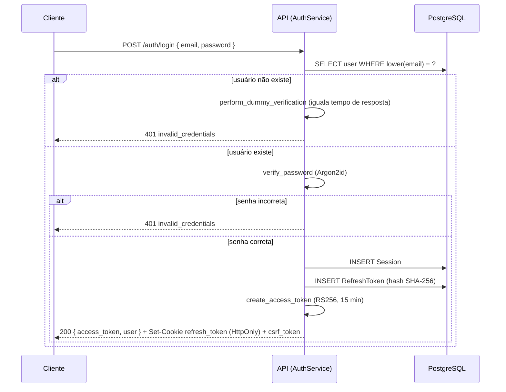
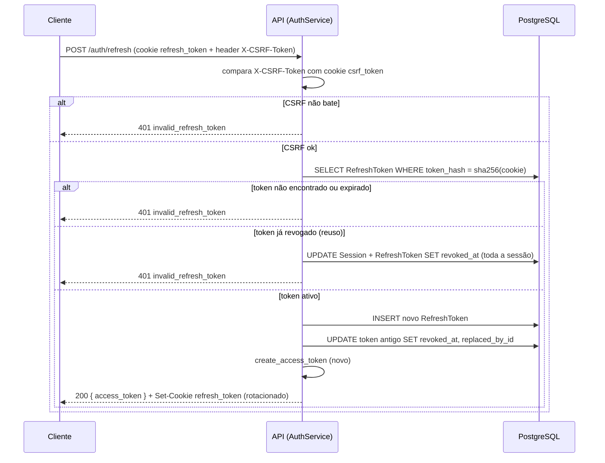
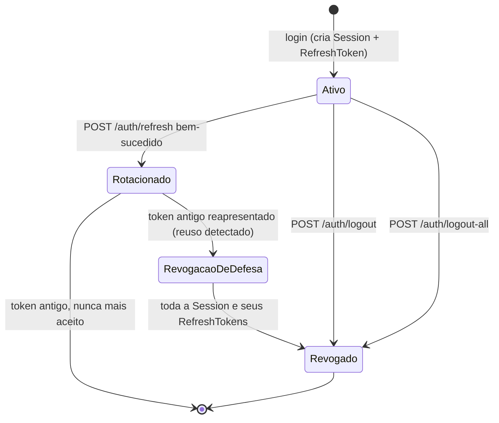
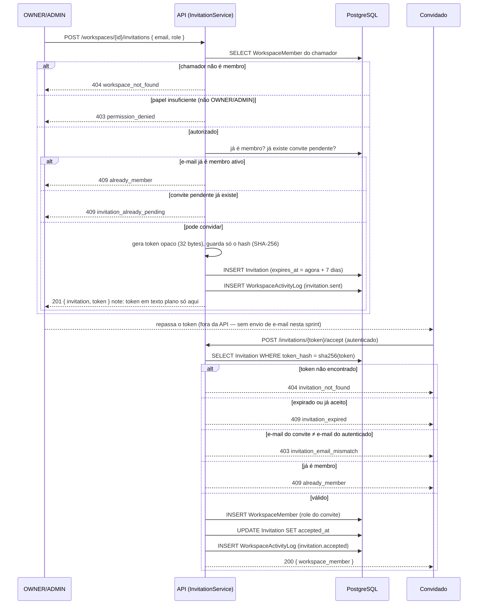
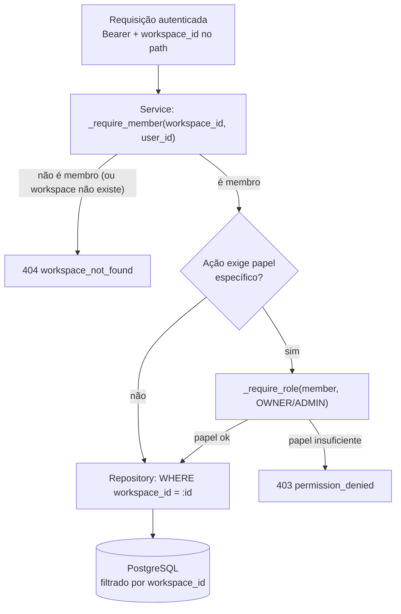

# 07 — Segurança

## 1. JWT (Access Token)

- Algoritmo `RS256` (par de chaves assimétrico), vida útil **15 minutos**. Curto de propósito: se um access token vazar (XSS, log acidental), a janela de exploração é pequena; a curta duração é o motivo pelo qual o refresh token existe (renovar sem forçar login a cada 15 min).
- Claims: `sub` (user_id), `iat`, `exp`, `jti` (identificador único do token, usado para blocklist pontual em Redis no caso raro de precisar revogar um access token específico antes da expiração — ex.: usuário reporta comprometimento). O `jti` já é gerado e está presente em todo token emitido (Sprint 3); a checagem ativa contra uma blocklist em Redis **não** está implementada ainda — logout hoje revoga a sessão/refresh token, e o access token remanescente expira sozinho em até 15 min, trade-off aceito explicitamente (ver ADR-008). Adicionar a blocklist é melhoria futura, não bloqueio desta sprint.
- Nunca embute papel/permissão (ver `docs/06-backend.md` §7) — permissão é sempre revalidada contra o banco a cada requisição.
- Transportado via header `Authorization: Bearer`, nunca em query string (evita vazamento via log de acesso/proxy).

## 2. Refresh Token

- Token opaco (não JWT), alta entropia, gerado com `secrets.token_urlsafe(32)`. O que é armazenado no banco é o **hash** do token (SHA-256), nunca o valor em texto plano — se o banco vazar, os tokens não são diretamente utilizáveis.
- Vida útil 30 dias, renovado (rotacionado) a cada uso: todo `POST /auth/refresh` bem-sucedido invalida o token usado e emite um novo, mantendo uma cadeia (`replaced_by_id`) para detecção de reuso.
- **Detecção de reuso**: se um refresh token já rotacionado (que não deveria mais existir como "ativo") for apresentado novamente, isso indica que o token pode ter sido roubado e já usado por um atacante — o sistema revoga **toda a cadeia** de tokens daquele usuário/dispositivo e força novo login. Este é o motivo central de rotacionar em vez de reusar o mesmo refresh token por 30 dias inteiros.
- Armazenado em cookie `HttpOnly; Secure; SameSite=Strict; Path=/api/v1/auth`. `HttpOnly` impede leitura via JavaScript (mitiga XSS); `Path` restrito reduz superfície de envio do cookie a apenas as rotas que precisam dele.

## 3. Cookies HttpOnly e por que o Access Token NÃO fica em cookie

Decisão deliberada: o **access token** vive em memória no frontend (variável de módulo), não em cookie. Se estivesse em cookie (mesmo `HttpOnly`), toda requisição à API o enviaria automaticamente, tornando a aplicação vulnerável a CSRF em **todas** as rotas mutáveis, não apenas em `/auth/refresh`. Mantendo o access token fora de cookie, CSRF só precisa ser mitigado no único endpoint que de fato depende de cookie de autenticação (`/auth/refresh`) — superfície de proteção mínima necessária, não máxima por precaução genérica.

Trade-off aceito: em caso de XSS bem-sucedido, o atacante pode ler o access token em memória (mas não o refresh token, que é `HttpOnly`) — limita o dano à janela de 15 minutos do access token comprometido, não a 30 dias.

## 4. CSRF

Aplica-se apenas a `POST /auth/refresh` (única rota que depende de cookie para autenticar). Estratégia: **double-submit cookie** — um cookie adicional, não-`HttpOnly` (`csrf_token`), é emitido no login; o frontend lê esse valor e o envia em um header customizado (`X-CSRF-Token`) em toda chamada a `/auth/refresh`. O backend compara header e cookie; JavaScript malicioso em outra origem não consegue ler o cookie `csrf_token` do FlowDesk para replicar o header (same-origin policy), então uma requisição forjada por um site de terceiro falha essa checagem mesmo que o cookie de refresh seja enviado automaticamente pelo navegador.

## 5. CORS

- Produção: origem permitida = domínio exato do frontend (lista explícita via `Settings`, nunca wildcard `*` combinado com `allow_credentials=True` — combinação proibida pela própria spec CORS por bom motivo).
- Desenvolvimento: origem `http://localhost:5173` (Vite) explicitamente configurada, não `*`, para que o comportamento de desenvolvimento espelhe produção e bugs de CORS sejam pegos cedo.
- `allow_credentials=True` (necessário para o cookie de refresh trafegar cross-origin entre o domínio do frontend e da API, caso sejam subdomínios distintos).

## 6. Rate Limiting

- Implementado via Redis (janela deslizante), no middleware (`docs/06-backend.md` §5), antes de qualquer lógica de negócio ser executada — uma requisição limitada nunca chega a tocar o banco.
- Limites diferenciados por sensibilidade de rota:
  - `/auth/login`, `/auth/register`: 5 requisições/minuto por IP (mitiga força bruta e enumeration de e-mail).
  - `/auth/refresh`: 10 requisições/minuto pela identidade da sessão (hash do próprio cookie `refresh_token`), com IP como fallback se o cookie não vier. Não é "por usuário" na prática: a identidade do usuário só é conhecida após consultar o banco, o que contradiz checar o limite *antes* de qualquer acesso a dado (ver ADR-008).
  - API em geral (autenticado): 300 requisições/minuto por usuário — generoso o suficiente para uso normal intenso (múltiplas abas, polling), restritivo o suficiente para conter um cliente com bug em loop.
- Resposta `429` inclui header `Retry-After`.

## 7. Hash de senhas

Argon2id (vencedor da Password Hashing Competition, resistente tanto a ataque por GPU quanto por side-channel — motivo de preferi-lo a bcrypt, que é adequado mas mais antigo e com menos resistência a paralelização por hardware dedicado). Parâmetros de custo (memória/iterações/paralelismo) calibrados para ~250ms por hash no hardware de produção alvo, revisados a cada major version do projeto conforme guidance da OWASP evolui.

## 8. Validação de permissões

Ver `CLAUDE.md` §10 e `docs/06-backend.md` §8 para a implementação. Matriz de permissões por papel (workspace-level):

| Ação | OWNER | ADMIN | MEMBER | GUEST |
|---|---|---|---|---|
| Gerenciar billing/exclusão do workspace | ✅ | ❌ | ❌ | ❌ |
| Convidar/remover membros | ✅ | ✅ | ❌ | ❌ |
| Alterar papel de membro | ✅ | ✅ (exceto OWNER) | ❌ | ❌ |
| Criar/editar/excluir time | ✅ | ✅ | ❌ | ❌ |
| Configurar workflow de status | ✅ | ✅ | ❌ | ❌ |
| Criar issue | ✅ | ✅ | ✅ | ❌ |
| Editar issue (qualquer) | ✅ | ✅ | ✅ | ❌ |
| Excluir issue (própria) | ✅ | ✅ | ✅ (se `creator_id` = self) | ❌ |
| Excluir issue (de outro) | ✅ | ✅ | ❌ | ❌ |
| Comentar | ✅ | ✅ | ✅ | ✅ (leitura+comentário) |
| Excluir comentário (próprio) | ✅ | ✅ | ✅ | ✅ |
| Excluir comentário (de outro) | ✅ | ✅ | ❌ | ❌ |
| Visualizar issues/board | ✅ | ✅ | ✅ | ✅ |

`GUEST` é um papel somente leitura + comentário, pensado para stakeholders externos observando o progresso sem poder alterar o trabalho — fora do MVP (ver `docs/00-product-vision.md` §5), mas já modelado na matriz para não exigir migração de schema quando for implementado.

Toda linha desta tabela corresponde a uma entrada em `PERMISSION_MATRIX` no código — a tabela **é** a especificação, o código é a implementação; divergência entre os dois é bug.

## 9. Isolamento entre Workspaces (multi-tenancy)

Defesa em profundidade, duas camadas independentes que precisam **ambas** falhar para haver vazamento cross-tenant:

1. **Camada de autorização**: todo método de service que opera sobre um `workspace_id` resolve a `WorkspaceMember` do chamador para aquele workspace antes de prosseguir — se não existir (workspace inexistente **ou** existente mas o chamador não é membro), levanta `WorkspaceNotFoundError` (404). Ações que exigem um papel específico (`OWNER`/`ADMIN`) fazem uma segunda checagem, `PermissionDeniedError` (403), só depois de confirmar que o chamador é membro.
2. **Camada de dados**: todo repository recebe `workspace_id` explicitamente e o aplica no `WHERE` de toda query (`CLAUDE.md` §6, `docs/03-database.md` §4) — mesmo que a camada de autorização tivesse um bug, uma query mal-intencionada para o `workspace_id` errado simplesmente não encontraria linhas (retorna 404, nunca dado de outro tenant).

Um único ponto de falha (ex.: esquecer de checar autorização em uma rota nova) não é suficiente para vazar dado entre tenants — é preciso que o desenvolvedor também esqueça de aplicar o filtro de `workspace_id` no repository, o que é estruturalmente difícil de esquecer porque o parâmetro é obrigatório na assinatura do método (não opcional com default `None`).

**Implementação real (Sprint 4) difere do esboço original desta seção**: a checagem de posse/papel hoje vive em duas funções puras no service (`_require_member`/`_require_role`, `backend/src/features/workspaces/service.py`), chamadas explicitamente no início de cada método — **não** via `Depends(require_permission(...))` sobre uma `PERMISSION_MATRIX` central em `core/authorization.py`, que ainda não existe. Essa infraestrutura de RBAC (§8 acima, que já descreve o desenho-alvo) é escopo explícito da Sprint 5; até lá, `_require_role` só entende "está na lista de papéis permitidos", sem a granularidade de ação-por-ação da matriz completa. A garantia de isolamento (item 1 acima) já vale hoje — o que falta é só a generalização/centralização da checagem de papel, não a checagem de posse do tenant. Ver ADR-009 em `docs/09-decision-log.md`.

### 9.1 Não-membro nunca recebe 403

Uma rota `/workspaces/{workspace_id}/...` chamada por alguém que não é membro daquele workspace responde **404**, nunca 403 — mesmo quando o workspace existe. Confirmar com 403 revelaria a um atacante que um dado `workspace_id` é válido (enumeration), o mesmo racional já aplicado a `invalid_credentials` (§10) e a qualquer lookup por ID de outro tenant. `403` só aparece quando o chamador **é** membro confirmado, mas com papel insuficiente para a ação (ex.: `MEMBER` tentando `PATCH` um workspace, ação restrita a `OWNER`).

## 10. Proteção contra acesso indevido — checklist consolidado

- IDs nunca são sequenciais/adivinháveis (UUID v7, `docs/03-database.md` §1) — mas isso é defesa superficial; a defesa real é a checagem de posse em toda leitura por ID (um UUID de outro workspace corretamente retorna `404`, não `403`, para não confirmar a existência do recurso a quem não tem acesso).
- Mensagens de erro de autenticação são deliberadamente genéricas (`invalid_credentials` tanto para e-mail inexistente quanto senha errada) — evita enumeration de e-mails cadastrados. Isso por si só não basta: sem cuidado extra, a resposta para "e-mail inexistente" seria muito mais rápida que "senha errada" (que roda Argon2id), vazando a mesma informação por tempo de resposta. Mitigação: quando o e-mail não existe, o login ainda roda uma verificação Argon2id contra um hash dummy fixo antes de retornar o erro, igualando o tempo dos dois caminhos (ADR-008).
- Toda ação destrutiva de alto impacto (excluir workspace, remover membro `OWNER`... este último é bloqueado por regra, não apenas por confirmação de UI) tem checagem server-side independente da confirmação de UI (RNF-UX-02 é UX, não segurança — a garantia real é sempre no backend).
- Segredos (chave privada JWT, credenciais de banco/Redis) nunca em código-fonte ou committed — apenas em variáveis de ambiente/secret manager do ambiente de deploy (`docs/06-backend.md` §10).

## 11. Diagramas de fluxo (Sprint 3)

### Login

### Refresh (com rotação e detecção de reuso)

### Ciclo de vida de Session/RefreshToken

`Session` é o nível que efetivamente controla acesso (`docs/09-decision-log.md` ADR-007, Decisão 3): revogar uma `Session` revoga em cascata todo `RefreshToken` ainda ativo dela, e é o mesmo mecanismo usado tanto por `logout` (uma sessão) quanto por `logout-all` (todas as sessões do usuário) quanto pela detecção de reuso (defesa automática).

## 12. Diagramas de fluxo (Sprint 4)

### Convite: criação → aceite

### Contexto Multi-Tenant — resolução de acesso por requisição

Não existe "workspace ativo" guardado em sessão de servidor — cada requisição a um recurso de tenant carrega `workspace_id` explícito no path (`CLAUDE.md` §4), e o service resolve posse a cada chamada, sem cache entre requisições (`core/security.py::CurrentUser` nunca embute papel/workspace — mesmo racional do JWT em `docs/06-backend.md` §7, evita permissão "stale"). "Alternar workspace" no frontend é só trocar qual `workspace_id` compõe a próxima URL chamada; ver ADR-009 para a justificativa completa de não introduzir um endpoint/estado de "workspace ativo".

